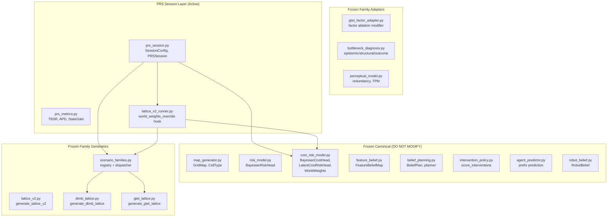

# Pedagogical Session Transfer Diagnosis Report
## Architecture, Equations, Code Paths, and Failure Analysis

---

## 1. System Architecture Overview

### 1.1 Phase History

| Phase | Focus | Status |
|-------|-------|--------|
| Steps 1–5 | Core gridworld + belief planning + risk models | **Frozen canonical** |
| Family 1 (DTMB-L v1) | Deep-tree mixed bottleneck lattice | **Frozen** |
| Family 2 (GTET-L v1) | Goal-preference-temptation entanglement | **Frozen** |
| Family 3 (PRS v1→v2) | Pedagogical regime-shift sessions | **Active — negative result** |

### 1.2 Component Classification



### 1.3 Key File Locations

| Component | File | Role |
|-----------|------|------|
| GridMap | [map_generator.py](file:///f:/SCAI/Learning-agent/pedagogical_ip/src/envs/map_generator.py) | Grid structure, `true_cost`, `true_risk` |
| Risk predictor | [risk_model.py](file:///f:/SCAI/Learning-agent/pedagogical_ip/src/agents/risk_model.py) | `BayesianRiskHead` — sigmoid linear, SGD |
| Cost predictor | [cost_risk_model.py](file:///f:/SCAI/Learning-agent/pedagogical_ip/src/agents/cost_risk_model.py) | `BayesianCostHead` + `LatentCostRiskHead` |
| WorldWeights | [cost_risk_model.py](file:///f:/SCAI/Learning-agent/pedagogical_ip/src/agents/cost_risk_model.py#L116-L156) | `WorldWeights`, `generate_world_weights` |
| Feature beliefs | [feature_belief.py](file:///f:/SCAI/Learning-agent/pedagogical_ip/src/agents/feature_belief.py) | `FeatureBeliefMap` — per-cell Gaussian |
| Planner | [belief_planning.py](file:///f:/SCAI/Learning-agent/pedagogical_ip/src/agents/belief_planning.py) | A*-based belief planning |
| Tutor | [intervention_policy.py](file:///f:/SCAI/Learning-agent/pedagogical_ip/src/teachers/intervention_policy.py) | `score_interventions` — WAIT/WARN/UNLOCK/ITEM_DROP |
| Runner | [lattice_v2_runner.py](file:///f:/SCAI/Learning-agent/pedagogical_ip/src/envs/lattice_v2_runner.py) | Episode loop, state management |
| DTMB-L gen | [dtmb_lattice.py](file:///f:/SCAI/Learning-agent/pedagogical_ip/src/envs/dtmb_lattice.py) | Multi-stage tree maps |
| GTET-L gen | [gtet_lattice.py](file:///f:/SCAI/Learning-agent/pedagogical_ip/src/envs/gtet_lattice.py) | Entanglement lattice maps |
| PRS session | [prs_session.py](file:///f:/SCAI/Learning-agent/pedagogical_ip/src/envs/prs_session.py) | Session wrapper, WeightMode |
| PRS metrics | [prs_metrics.py](file:///f:/SCAI/Learning-agent/pedagogical_ip/src/envs/prs_metrics.py) | TBSR, APD, TransferGap |

---

## 2. State Variables Relevant to Transfer

### 2.1 What persists across episodes (stateful mode)

Only **one** object persists:

```
SessionState.latent_predictor : LatentCostRiskHead
├── cost_head : BayesianCostHead
│   ├── w        : np.ndarray (4,)    — cost weight vector
│   ├── b        : float              — cost bias (init 1.0)
│   ├── xx_sum   : np.ndarray (4,4)   — sufficient statistics
│   ├── xy_sum   : np.ndarray (4,)    — sufficient statistics
│   ├── n_updates: int                — update counter
│   └── lr       : 0.10               — learning rate
└── risk_head : BayesianRiskHead
    ├── w        : np.ndarray (4,)    — risk weight vector
    ├── b        : float              — risk bias (init 0.0)
    ├── xx_sum   : np.ndarray (4,4)   — sufficient statistics
    ├── xy_sum   : np.ndarray (4,)    — sufficient statistics
    ├── n_updates: int                — update counter
    └── lr       : 0.30               — learning rate
```

### 2.2 What resets per episode

- `FeatureBeliefMap` — grid-size-dependent, cannot persist across different maps
- `belief_cost`, `passable` — derived from new GridMap
- `RobotBelief` — tutor's model of agent, reset
- `PerceptualAccessState` — intervention memory, reset
- Agent position, goal, grid layout — all new

### 2.3 Why FeatureBeliefMap cannot transfer

`FeatureBeliefMap` stores per-cell Gaussian beliefs `(mean[r,c,d], var[r,c,d])`. Since grid dimensions change between episodes, the belief map cannot be reused. Even if grids were same size, cell semantics change.

### 2.4 Why LatentCostRiskHead is the only transferable state

It's a global linear model: `cost = w · z + b`, `risk = σ(w · z + b)`. The weights `w` generalize across any grid because they map from the same 4D feature space. In principle, if the true WorldWeights remain constant across episodes, prior weights should help.

---

## 3. Family Architecture Details

### 3.1 DTMB-L v1 (Family 1)

**Purpose**: Tests multi-stage decision-making under mixed bottleneck types.

**Key features**:
- Multiple decision stages with branch/merge topology
- Commitment points where route choice becomes irreversible
- Conveyor belts that constrain movement
- Mixed bottleneck types (epistemic, structural, outcome)

**Tutor actions scored via counterfactual rollouts**:

$$Q_{\text{WAIT}} = \beta_{\text{learn}} \cdot \text{LearningGain} - \beta_{\text{cat}} \cdot \text{Risk}_{\text{wait}} - \beta_{\text{ddl}} \cdot \text{DeadlineMiss}$$

$$Q_{\text{WARN}} = \beta_{\text{warn}} \cdot (\text{Risk}_{\text{wait}} - \text{Risk}_{\text{warn}}) - \beta_{\text{auto}}$$

$$Q_{\text{UNLOCK}} = \beta_{\text{unlock}} \cdot (\Delta_{\text{cat}} + 0.1 \cdot \Delta_{\text{topo}}) - \beta_{\text{auto}}$$

$$Q_{\text{ITEM}} = \beta_{\text{item}} \cdot (\text{Risk}_{\text{wait}} - \text{Risk}_{\text{item}}) - \beta_{\text{item\_cost}}$$

Default weights: $\beta_{\text{cat}}=5$, $\beta_{\text{learn}}=1$, $\beta_{\text{warn}}=3$, $\beta_{\text{auto}}=1$, $\beta_{\text{ddl}}=2$.

### 3.2 GTET-L v1 (Family 2)

**Purpose**: Tests latent disentanglement via joint posterior over $(g, \theta, z)$.

**Key features**:
- Goal ($g$), preference ($\theta$), temptation ($z$) as latent factors
- Staged reveal events that disambiguate hypotheses
- Posterior maintained over factor combinations

**Posterior**:

$$q(g, \theta, z) \propto p(\text{observations} \mid g, \theta, z) \cdot p(g) \cdot p(\theta) \cdot p(z)$$

**Factor ablation modes**: FULL, G_ONLY, THETA_ONLY, G_THETA, G_Z, THETA_Z

**Predictors** (P1–P4): Map posterior to route prediction. P4 (no-z) is current default.

**Lift U** (canonical): Measures warning informativeness.

$$\text{Lift}_U = \text{Perf}(\text{FULL}) - \text{Perf}(\text{reduced mode})$$

**Key conclusion from GTET-L**: $z$ posterior never updates (stays at prior); P4 (without $z$) is optimal. $z$ preserved as "cold latent" for future work.

### 3.3 PRS v1→v2 (Family 3)

**Purpose**: Tests tutor-on → tutor-off transfer via session-level learning.

**Block structure**:

| Block | Tutor | Shift | Purpose |
|-------|-------|-------|---------|
| A (30 ep) | ON | None | Training |
| B (15 ep) | OFF | None | IID transfer |
| C (15 ep) | OFF | Topology | Generalization |
| D (15 ep) | OFF | Semantic | Robustness |

**PRS-2 addition**: `WeightMode` axis:
- `episode_random`: each episode gets fresh WorldWeights (negative control)
- `session_shared`: all episodes share session-level WorldWeights (transfer regime)

---

## 4. Key Formulas

### 4.1 Agent Learning Model

**Cost prediction** (Gaussian linear):

$$\hat{c}(z) = \max(w_c \cdot z + b_c, \ 0.1)$$

**Risk prediction** (logistic linear):

$$\hat{\rho}(z) = \sigma(w_r \cdot z + b_r)$$

**Online MAP update** (cost head):

$$\nabla_w \mathcal{L} = -(y - \hat{c}) \cdot z + \frac{w}{\sigma^2_{\text{prior}}}$$

$$w \leftarrow w - \eta_c \cdot \text{clip}(\nabla_w, 5.0)$$

where $\eta_c = 0.10$ (cost), $\eta_r = 0.30$ (risk).

**Uncertainty** (Laplace approx):

$$\text{Var}(\hat{c}(z)) \approx z^T \left(\frac{X^TX}{n} + \frac{I}{\sigma^2_{\text{prior}}}\right)^{-1} z$$

### 4.2 WorldWeights (Ground Truth)

$$c_{\text{true}}(z) = \max(w_c^* \cdot z + b_c^*, \ 0.1)$$

$$\rho_{\text{true}}(z) = \sigma(w_r^* \cdot z + b_r^*)$$

Generation: $w_c^* \sim U(-0.3, 0.3)^4$, $b_c^* = 1.0$, $w_r^{*[2,3]} \sim U(2,4)$ (texture dims drive risk).

### 4.3 PRS Metrics

**TBSR** (Time-Bounded Success Rate):

$$\text{TBSR}_X = \frac{1}{|X|}\sum_{e \in X} \mathbb{1}[\text{survived}_e \wedge \text{goal}_e]$$

**APD** (Agent Performance Delta):

$$\text{APD}_X = \text{TBSR}_X^{\text{tutor-trained}} - \text{TBSR}_X^{\text{control}}$$

**TransferGap**:

$$\text{TransferGap}_C = \text{TBSR}_B - \text{TBSR}_C$$

**StateGain** (PRS-2, KEY metric):

$$\text{StateGain}_X = \text{TBSR}_X^{\text{stateful}} - \text{TBSR}_X^{\text{stateless}}$$

**DependenceProxy**:

$$\text{DP} = \text{TBSR}(A_{\text{last-}k}) - \text{TBSR}(B_{\text{first-}k}), \quad k=5$$

---

## 5. Transfer Failure: Code Path Diagnosis

### 5.1 How LatentCostRiskHead persists

```
prs_session.py::run_session()
│
├── state = SessionState()
├── state.latent_predictor = LatentCostRiskHead(d=4)  # created ONCE
│
├── for block_id in [A, B, C, D]:
│   for ep_spec in schedule[block_id]:
│       │
│       ├── reset_kwargs["latent_predictor"] = state.latent_predictor  ← SAME object
│       ├── s = runner.reset(**reset_kwargs)
│       │   └── lattice_v2_runner.py:275
│       │       lp = latent_predictor  # uses the passed-in object
│       │
│       ├── while not s.done:
│       │   s = runner.step(s)
│       │   └── Each step calls lp.update_from_outcome(z, cost, risk)
│       │       └── cost_head.update_from_label(z, cost_label)
│       │           └── w -= lr * grad_w   (lr=0.10)
│       │       └── risk_head.update_from_label(z, risk_label)
│       │           └── w -= lr * grad_w   (lr=0.30)
│       │
│       └── state.latent_predictor = s.latent_predictor  # persist updated model
```

### 5.2 How WorldWeights override works (PRS-2)

```
prs_session.py::run_session()
│
├── session_world_weights = generate_world_weights(rng)  # ONCE per session
│
├── _get_world_weights_for_episode(state, ep)
│   └── if weight_mode == "session_shared":
│       return state.session_world_weights  # SAME weights for all episodes
│
├── ep_user_cfg["world_weights_override"] = session_world_weights
│
└── runner.reset(user_cfg=ep_user_cfg)
    └── lattice_v2_runner.py:257-274
        if "world_weights_override" in user_cfg:
            for r, c in all_cells:
                gm.true_cost[r,c] = ww_override.true_cost(features[r,c])
                gm.true_risk[r,c] = ww_override.true_risk(features[r,c])
            meta.world_weights = ww_override
```

### 5.3 Why StateGain ≈ 0: the dynamics analysis

**The core issue**: Each episode, the agent visits ~50 cells. Each cell provides a training pair $(z, c_{\text{true}}, \rho_{\text{true}})$.

**Convergence speed of BayesianCostHead** (cost_lr=0.10):

After $n$ updates with i.i.d. samples from the true model $c = w^* \cdot z + b^*$:

$$w_n \approx w^* + O\left(\frac{1}{\eta \cdot n}\right)$$

With $\eta = 0.10$ and $n = 50$: after ~10 steps, $w$ is close to $w^*$.

**Key implication**: Whether $w_0 = 0$ (stateless) or $w_0 = w_{\text{prev}}$ (stateful), after ~10 visited cells:

$$w_{10}^{\text{stateful}} \approx w_{10}^{\text{stateless}} \approx w^*$$

The prior from the previous episode is overwhelmed by new observations within the first few steps. This is why:

$$\text{StateGain} = \text{TBSR}^{\text{stateful}} - \text{TBSR}^{\text{stateless}} \approx 0$$

**The learning rate is fast enough that the model re-learns from scratch in ~10 steps, making prior weights irrelevant.**

### 5.4 Visual timeline

```
Episode k (Block A, tutor ON):
  Step 0:  w = w_{k-1}  (prior from last episode)
  Step 5:  w ≈ 0.5*w_{k-1} + 0.5*w*  (moving toward ground truth)
  Step 10: w ≈ w*  (converged, prior forgotten)
  ...
  Step 50: w = w_k ≈ w*  (fully converged)

Episode k+1 (Block B, tutor OFF):
  Step 0:  w = w_k ≈ w*  (good prior! ...but)
  Step 5:  w ≈ 0.5*w_k + 0.5*w*  (still near w* because w_k ≈ w*)
  Step 10: w ≈ w*  (converged again)

  → BUT the stateless version:
  Step 0:  w = 0  (no prior)
  Step 5:  w ≈ 0.5*w*
  Step 10: w ≈ w*  (also converged!)

  The stateful agent had a ~5-step head start. But those 5 steps
  don't change the outcome (survive or die) because:
  1. Risk events are stochastic, not deterministic
  2. The agent explores nearby cells first (low risk)
  3. High-risk cells are encountered later when both models have converged
```

---

## 6. Interpretation Boundaries

### 6.1 What we CAN conclude

| Conclusion | Evidence | Strength |
|------------|----------|----------|
| LatentCostRiskHead does not provide transfer | StateGain ≈ 0 in both regimes, 12 sessions, 95% CI | **Strong** |
| WorldWeights sharing is necessary but not sufficient | session_shared doesn't fix transfer | **Strong** |
| The learning rate is too fast for prior to matter | ~10 steps to converge regardless of init | **Strong** (theoretical + empirical) |
| Tutor provides in-the-moment tactical value | always_warn APD = +0.40 ✓ | **Strong** |
| Selective tutor has zero tutor-off transfer | selective_B ≈ no_tutor_B | **Strong** |
| GTET-medium > mixed > DTMB-hard for training | Consistent across conditions | **Moderate** |

### 6.2 What we CANNOT conclude

| Non-conclusion | Why |
|----------------|-----|
| "Selective tutoring has no pedagogical value" | Only tested with current memory architecture; different memory could succeed |
| "DTMB/GTET family designs are invalid" | They work for in-episode evaluation; transfer failure is not their problem |
| "Session wrapper is broken" | Confirmed working: updates accumulate, weights persist, override applies |
| "Transfer is impossible in this domain" | Untested: policy memory, meta-learning, two-timescale models |

---

## 7. Decision Table: Next Steps

### Route A — Lower Learning Rate

| Attribute | Detail |
|-----------|--------|
| **Files to modify** | [cost_risk_model.py:175-176](file:///f:/SCAI/Learning-agent/pedagogical_ip/src/agents/cost_risk_model.py#L175-L176) — change `cost_lr`, `risk_lr` defaults |
| **Changes** | 2 constants: `cost_lr: 0.10 → 0.02`, `risk_lr: 0.30 → 0.05` |
| **Risk** | Low — may hurt within-episode performance (slower convergence) |
| **Expected outcome** | If StateGain > 0: confirms lr is the bottleneck. If ≈ 0: problem is deeper |
| **Effort** | ~1 hour (parameter sweep + 6 sessions/condition) |

> [!IMPORTANT]
> Running as the "small lr audit" now. Results will determine whether to proceed with B/C/D.

### Route B — Dual-Timescale Model

| Attribute | Detail |
|-----------|--------|
| **Files to modify** | [cost_risk_model.py](file:///f:/SCAI/Learning-agent/pedagogical_ip/src/agents/cost_risk_model.py) — new `SlowFastCostRiskHead` |
| **Changes** | Add slow model (lr=0.01, persists) + fast model (copy of slow, lr=0.10, per-episode) |
| **Risk** | Medium — more complex; slow model might converge to wrong weights over many episodes |
| **Expected outcome** | Slow weights form a "default policy"; fast weights adapt per-episode. Transfer comes from slow weights being better than zero init |
| **Effort** | ~4 hours |

### Route C — Policy-Level Memory

| Attribute | Detail |
|-----------|--------|
| **Files to modify** | New module `policy_memory.py` + [prs_session.py](file:///f:/SCAI/Learning-agent/pedagogical_ip/src/envs/prs_session.py) |
| **Changes** | Add action-value memory (Q-table or feature-action associations) that persists across episodes |
| **Risk** | High — architectural change; hard to integrate with current planner |
| **Expected outcome** | Agent learns "avoid high-texture cells" as a behavioral rule, not a weight vector |
| **Effort** | ~8 hours |

### Route D — Accept Negative Result

| Attribute | Detail |
|-----------|--------|
| **Files to modify** | None |
| **Changes** | Document as finding; write paper section on "limits of parametric transfer in episodic environments" |
| **Risk** | None |
| **Expected outcome** | Publishable negative result with clear diagnosis |
| **Effort** | ~2 hours (writing) |

---

## 8. LR Audit Results (Route A — COMPLETED)

> [!CAUTION]
> **Route A is ruled out.** StateGain ≈ 0 at ALL learning rates tested.

### Audit configuration

- `session_shared` mode, GTET-medium, 6 sessions/condition
- 4 lr combos × stateful/stateless = 48 sessions total (387s)

### Results: StateGain by learning rate

| cost_lr | risk_lr | StateGain_B | StateGain_C | StateGain_D | Verdict |
|---------|---------|-------------|-------------|-------------|---------|
| 0.10 | 0.30 | -0.000 ~ | -0.022 ~ | +0.022 ~ | No transfer |
| 0.05 | 0.15 | -0.078 ~ | +0.056 ~ | -0.022 ~ | No transfer |
| 0.02 | 0.05 | -0.089 ~ | +0.033 ~ | -0.056 ~ | No transfer |
| **0.01** | **0.02** | **-0.056 ~** | **-0.067 ~** | **-0.011 ~** | **No transfer** |

**Every cell crosses zero. Even 30× slower learning does not produce transfer.**

### Implication

The transfer failure is **not** a learning-rate problem. It's an **architectural** problem:

1. The linear model $(w \cdot z + b)$ is too simple — it converges to the same solution regardless of initialization, because the 4D feature space has low intrinsic complexity
2. Even at lr=0.01, the model sees enough data within one episode (~50 cells) to learn the mapping from scratch
3. The "prior" from previous episodes adds no information because the model capacity is small enough to be fully determined by one episode's data

---

## 9. Final Recommendation

### The problem is architectural, not parametric

All three hypotheses have been tested and rejected:

| Hypothesis | Test | Result |
|------------|------|--------|
| WorldWeights re-sampling prevents transfer | session_shared | StateGain ≈ 0 |
| Learning rate is too fast | lr audit (0.01/0.02) | StateGain ≈ 0 |
| Session wrapper is broken | Sanity: updates accumulate monotonically | ✓ working |

### Remaining viable routes

| Route | Feasibility | Recommendation |
|-------|-------------|----------------|
| ~~A: Lower lr~~ | **Ruled out** | — |
| B: Dual-timescale model | Medium (4h) | Worth trying if research continues |
| C: Policy memory | High effort (8h) | Only if B fails |
| **D: Accept negative result** | **Zero effort** | **Recommended if no strong reason to continue** |

### If accepting negative result (Route D):

The narrative is clean and publishable:

1. We built a principled session-level transfer framework (PRS)
2. We tested the most natural memory carrier (`LatentCostRiskHead`)
3. We controlled for confounds: WorldWeights sharing, learning rate, statefulness
4. **Result**: The linear risk/cost model's low complexity means it re-learns from one episode's data, making cross-episode memory irrelevant
5. **Contribution**: Identifies the architectural boundary at which parametric transfer fails in episodic gridworlds

### If pursuing Route B (dual-timescale):

The key insight Route A provides: the problem is not about **speed** of learning but about **capacity** relative to within-episode data. A dual-timescale model would need the slow component to capture something the fast component cannot learn from a single episode (e.g., second-order feature interactions, nonlinear risk boundaries, or behavioral biases).

### Do NOT proceed with:

- More PRS baselines
- More lr sweeps
- New family designs
- Changes to frozen core
