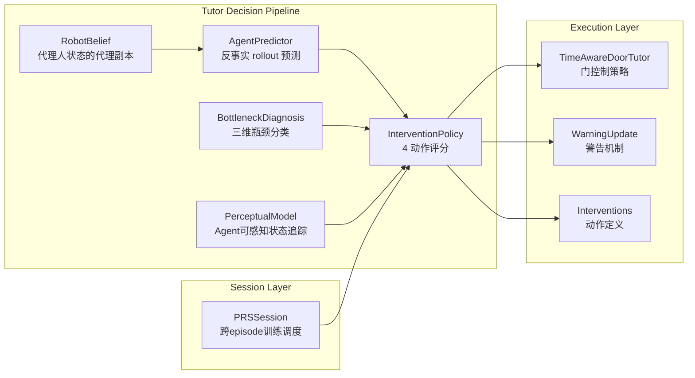

# Pedagogical Gridworld: Tutor System Design Report
## Complete Specification of Intervention Policy, Robot Belief, Scoring, and Warning Mechanics

---

## 1. 系统架构总览

Tutor 系统由以下模块组成：



**核心设计原则**：
- Tutor **不能**直接访问真实的 trap positions、latent 特征向量、或真实 risk 值
- 所有决策基于对 agent 内部状态的**近似代理模型** (RobotBelief)
- 干预通过**反事实 rollout**评分：评估"如果什么都不做" vs "如果干预"的对比效果

---

## 2. 干预动作类型

### 2.1 四种主要干预

定义于 [interventions.py](file:///f:/SCAI/Learning-agent/pedagogical_ip/src/teachers/interventions.py)：

| 动作 | 类型 | 语义 | 代价 |
|------|------|------|------|
| **WAIT** | `InterventionType.WAIT` | 不干预，让 agent 自主行动 | 0 |
| **WARN** | `InterventionType.WARN` | 发送风险警告消息 | autonomy_penalty |
| **UNLOCK** | `InterventionType.UNLOCK_DOOR` | 打开一扇锁门 | autonomy_penalty |
| **ITEM_DROP** | `InterventionType.DROP_SHIELD` | 给 agent 一个 shield | item_drop_cost |

还有一个 `BLOCK_PATH`（legacy/debug），**不参与主线评分比较**。

### 2.2 Shield 物品系统

```python
@dataclass
class InventoryState:
    shield: int = 0                    # 0 或 1，不可叠加
    shield_risk_reduction: float = 0.5 # 默认减半 risk

SHIELD_DEFAULT_RISK_REDUCTION = 0.5
```

Shield 的语义：
- Agent 最多持有 1 个 shield（不可叠加）
- 进入 RISKY cell 时自动消耗 shield
- 消耗后 risk 降低 50%: $\rho_{\text{effective}} = \rho_{\text{true}} \times (1 - 0.5) = 0.5\rho_{\text{true}}$

### 2.3 警告词汇表

```python
WARNING_VOCAB = [
    # RSA 语义警告
    "LEFT_RISKY", "RIGHT_RISKY", "UPPER_RISKY", "LOWER_RISKY",
    "DOOR_PATH_SAFE", "CURRENT_PATH_RISKY",
    # Legacy 别名
    "LEFT_AREA_RISKY", "RIGHT_AREA_RISKY", "CURRENT_PLAN_RISKY",
]
```

---

## 3. RobotBelief — 代理人状态的代理副本

### 3.1 结构

定义于 [robot_belief.py](file:///f:/SCAI/Learning-agent/pedagogical_ip/src/teachers/robot_belief.py)：

```python
@dataclass
class RobotBelief:
    # 代理信念的近似副本
    agent_belief_mean: np.ndarray       # (H, W, d) 特征均值
    agent_belief_var: np.ndarray        # (H, W, d) 特征方差

    # 代理能力的估计
    agent_search_budget: int = 30
    agent_risk_weight: float = 3.0
    agent_uncertainty_weight: float = 0.5
    agent_lambda_c: float = 1.0        # cost 权重
    agent_lambda_uc: float = 0.1       # uncertainty cost 权重
    agent_lambda_ur: float = 0.1       # uncertainty risk 权重

    # Latent predictor 快照（只读）
    _predictor_cost_w: np.ndarray       # (4,)
    _predictor_cost_b: float
    _predictor_risk_w: np.ndarray       # (4,)
    _predictor_risk_b: float
```

### 3.2 同步模式

| 模式 | 行为 | 用途 |
|------|------|------|
| `exact` | 每步完整复制 agent 状态 | 理想化 tutor（正控制） |
| `noisy` | 每步复制 + 高斯噪声 $\mathcal{N}(0, \sigma^2_{\text{noise}})$ | 测试噪声鲁棒性 |
| `stale` | 每 N 步才同步一次 | 模拟通信延迟 |

**同步公式**：

```
exact:  μ_robot = μ_agent              (exact copy)
noisy:  μ_robot = μ_agent + N(0, 0.05²)  (with noise)
stale:  μ_robot = μ_agent   if (t - t_last_sync) ≥ stale_interval
        μ_robot = μ_robot   otherwise   (keep old copy)
```

### 3.3 能力估计偏差

Tutor 可以故意错误估计 agent 的能力：
- `budget_mismatch`: 加到 agent 的搜索预算估计上（可为负）
- `risk_weight_mismatch`: 加到 agent 的 risk 权重估计上

这用于测试 tutor 在对 agent 能力有偏差认知时的鲁棒性。

---

## 4. 反事实预测系统 (AgentPredictor)

### 4.1 预测流程

定义于 [agent_predictor.py](file:///f:/SCAI/Learning-agent/pedagogical_ip/src/teachers/agent_predictor.py)：

```
predict_agent_prefix(rb, agent_pos, goal, ...):
  1. build_surrogate_predictor(rb) → 从 RobotBelief 恢复 agent 的 cost/risk 模型
  2. plan_from_belief(...) → 用 surrogate 模型做 belief-space A* planning
  3. plan_with_alternatives_v2(...) → 评估多条候选路径
  4. estimate_failure_modes(...) → 诊断预计失败模式
  → 返回 AgentPrediction
```

### 4.2 四种反事实 rollout

| Rollout | 函数 | 修改 | 原理 |
|---------|------|------|------|
| WAIT baseline | `predict_agent_prefix()` | 无 | Agent 按当前信念自主行动 |
| WARN | `predict_agent_prefix_after_warn()` | 在 warned cells 上加 extra_cost | 模拟警告后 agent 避开危险区 |
| UNLOCK | `predict_agent_prefix_after_unlock()` | unlock_cells 设为 passable | 模拟开门后新路径可用 |
| ITEM_DROP | `predict_agent_prefix_after_item_drop()` | clone inventory + add shield | 模拟 shield 降低 risk 后的行为变化 |

**关键约束**：所有 rollout 是**只读**的。它们使用 clone 的 surrogate，**不修改**真实 agent 或环境状态。

### 4.3 学习收益估计

$$\text{LearningGain} = \frac{1}{|P|} \sum_{(r,c) \in P} \bar{\sigma}^2_{r,c}$$

其中 $P$ 是 predicted prefix 路径，$\bar{\sigma}^2_{r,c}$ 是 cell $(r,c)$ 的 belief variance 均值。

直觉：如果 agent 计划路径上有很多不确定的 cell，WAIT 让它自己探索会减少不确定性。

---

## 5. 干预评分公式

### 5.1 核心评分

定义于 [intervention_policy.py](file:///f:/SCAI/Learning-agent/pedagogical_ip/src/teachers/intervention_policy.py)：

#### WAIT 分数

$$Q_{\text{WAIT}} = w_{\text{lg}} \cdot \text{LearningGain} - w_{\text{cat}} \cdot \rho_{\text{wait}} - w_{\text{dl}} \cdot P_{\text{deadline\_miss}}$$

| 项 | 权重 | 默认值 | 含义 |
|----|------|--------|------|
| $w_{\text{lg}}$ | `learning_gain_weight` | 1.0 | 探索学习收益 |
| $w_{\text{cat}}$ | `catastrophe_weight` | 5.0 | 灾难风险惩罚 |
| $w_{\text{dl}}$ | `deadline_weight` | 2.0 | 超时 miss 惩罚 |

#### WARN 分数

$$Q_{\text{WARN}} = w_{\text{we}} \cdot \max(0, \rho_{\text{wait}} - \rho_{\text{warn}}) - \alpha_{\text{auto}}$$

| 项 | 权重 | 默认值 | 含义 |
|----|------|--------|------|
| $w_{\text{we}}$ | `warn_effect_weight` | 3.0 | 警告减少灾难的效果 |
| $\alpha_{\text{auto}}$ | `autonomy_penalty` | 1.0 | 干预代价（保护 agent 自主性） |

#### UNLOCK 分数

$$Q_{\text{UNLOCK}} = w_{\text{ue}} \cdot \left(\Delta\rho_{\text{unlock}} + 0.1 \cdot \Delta L\right) - \alpha_{\text{auto}}$$

其中：
- $\Delta\rho_{\text{unlock}} = \max(0, \rho_{\text{wait}} - \rho_{\text{unlock}})$ — risk 改善
- $\Delta L = \max(0, L_{\text{wait}} - L_{\text{unlock}})$ — 路径缩短

如果没有可解锁的门：$Q_{\text{UNLOCK}} = -2\alpha_{\text{auto}}$

#### ITEM_DROP 分数

$$Q_{\text{ITEM}} = w_{\text{id}} \cdot \max(0, \rho_{\text{wait}} - \rho_{\text{item}}) - c_{\text{item}}$$

| 项 | 权重 | 默认值 | 含义 |
|----|------|--------|------|
| $w_{\text{id}}$ | `item_drop_weight` | 3.0 | Shield 减灾效果 |
| $c_{\text{item}}$ | `item_drop_cost` | 1.5 | 物品使用代价 > autonomy_penalty |

### 5.2 InterventionConfig 完整参数

```python
@dataclass
class InterventionConfig:
    catastrophe_weight: float = 5.0
    learning_gain_weight: float = 1.0
    warn_effect_weight: float = 3.0
    unlock_effect_weight: float = 3.0
    item_drop_weight: float = 3.0
    autonomy_penalty: float = 1.0
    deadline_weight: float = 2.0
    item_drop_cost: float = 1.5
    item_drop_enabled: bool = True
    # Phase 10: TPM 权重
    bottleneck_match_weight: float = 2.0   # β_b
    redundancy_penalty_weight: float = 1.5 # β_R
    # Phase 10: 消融开关
    use_bottleneck_matching: bool = True
    use_warn_damping: bool = True
    use_unlock_memory: bool = True
    use_perceptual_access: bool = True
```

---

## 6. 瓶颈诊断 (BottleneckDiagnosis)

### 6.1 三维瓶颈分类

定义于 [bottleneck_diagnosis.py](file:///f:/SCAI/Learning-agent/pedagogical_ip/src/teachers/bottleneck_diagnosis.py)：

| 瓶颈类型 | 含义 | 对应 Lever |
|---------|------|-----------|
| **epistemic** | Agent 缺乏关于决策关键 cell 的信息 | WARN |
| **structural** | Agent 因地形限制无法按时到达目标 | UNLOCK |
| **outcome** | Agent 面临不可避免的风险 | ITEM_DROP |

### 6.2 诊断公式

#### Epistemic 分数

$$S_{\text{epi}} = U_D \cdot (1 + \max(0, Q_{\text{WARN}} - Q_{\text{WAIT}}))$$

其中 decision-relevant uncertainty：

$$U_D = \frac{1}{|D|} \sum_{i \in D} \left[\omega_\rho \cdot (1 - \rho_i) + \omega_u \cdot \hat{u}_{r,i}\right]$$

- $\rho_i$ = tutor 估计 agent 看到 cell $i$ 的概率
- $\hat{u}_{r,i}$ = cell $i$ 的 risk uncertainty
- $\omega_\rho = 1.0, \omega_u = 1.0$

#### Structural 分数

$$S_{\text{str}} = g(t) \cdot (1 + \max(0, Q_{\text{UNLOCK}} - Q_{\text{WAIT}}))$$

其中 structural urgency：

$$g(t) = \begin{cases} 1.0 & \text{if slack} \leq 0 \text{ or has\_locked\_doors} \\ e^{-\text{slack} / \tau_s} & \text{otherwise} \end{cases}$$

$\tau_s = 3.0$（temperature）

#### Outcome 分数

$$S_{\text{out}} = \rho_{\text{min\_path}} \cdot (1 + \max(0, Q_{\text{ITEM}} - Q_{\text{WAIT}}))$$

### 6.3 瓶颈-干预匹配加分

$$Q'_a = Q_a + \beta_b \cdot M(a, \text{bottleneck})$$

其中：

$$M(a, b) = \begin{cases} S_{\text{epi}} & \text{if } a = \text{WARN} \\ S_{\text{str}} & \text{if } a = \text{UNLOCK} \\ S_{\text{out}} & \text{if } a = \text{ITEM\_DROP} \\ 0 & \text{if } a = \text{WAIT} \end{cases}$$

$\beta_b = 2.0$ (bottleneck_match_weight)

---

## 7. Tutor 感知模型 (PerceptualAccessState)

### 7.1 核心状态变量

定义于 [perceptual_model.py](file:///f:/SCAI/Learning-agent/pedagogical_ip/src/teachers/perceptual_model.py)：

$$\rho_{i,t} = P(\text{agent 已有效看到 cell } i \text{ 在时刻 } t)$$

### 7.2 更新规则

每步更新，对 agent 位置附近 patch 内的每个 cell：

$$p_{\text{see}} = e^{-\lambda_d \cdot d} \cdot q_{\text{obs}}$$

$$\rho_{i,t+1} = 1 - (1 - \rho_{i,t}) \cdot (1 - p_{\text{see}})$$

| 参数 | 默认值 | 含义 |
|------|--------|------|
| `patch_radius` | 2 | 观察半径 (Manhattan) |
| `lambda_distance` | 0.8 | 距离衰减率 |
| `base_self_var` | 0.01 | 自身 cell 观测噪声 |
| `base_neighbor_var` | 0.08 | 邻居 cell 观测噪声 × d |

**单调性**：$\rho$ 只增不减（once seen, always seen）

### 7.3 Redundancy 惩罚

对 WARN 评估冗余度（如果 agent 已经知道这些 cell 就没必要再警告）：

$$R_{\text{warn}} = \frac{1}{|D|} \sum_{i \in D} \rho_i \cdot e^{-u_{r,i} / \tau_u}$$

- 高 $R_{\text{warn}}$ → agent 已经看到了，警告无用
- $\tau_u = 0.3$

**WARN 分数修正**：

$$Q'_{\text{WARN}} = Q_{\text{WARN}} - \beta_R \cdot R_{\text{warn}}$$

$\beta_R = 1.5$ (redundancy_penalty_weight)

### 7.4 额外抑制

1. **WARN damping**（outcome-dominant 场景）：如果 ITEM_DROP 可用且 outcome 瓶颈主导 epistemic：

$$Q'_{\text{WARN}} -= \min(2.0, \frac{S_{\text{out}}}{S_{\text{epi}} + 0.01} \times 0.5)$$

2. **Repeat penalty**：每多发一次 WARN，惩罚 0.5：

$$Q'_{\text{WARN}} -= n_{\text{warns}} \times 0.5$$

3. **UNLOCK memory**：如果已经 UNLOCK 过且没有剩余锁门：

$$Q'_{\text{UNLOCK}} -= 2\alpha_{\text{auto}}$$

---

## 8. 警告机制详解

### 8.1 双机制设计

定义于 [warning_update.py](file:///f:/SCAI/Learning-agent/pedagogical_ip/src/agents/warning_update.py)：

警告通过**两个并行通道**影响 agent：

#### 通道 1：Pseudo-label 注入（跨 episode 学习）

将警告信息注入 agent 的 `BayesianRiskHead`，修改其对 risk 的内部理解：

$$\text{risk\_head.update\_from\_label}(z_{\text{proto}}, y_{\text{label}}, w_{\text{eff}})$$

| Utterance | Prototype $z_{\text{proto}}$ | Pseudo-label $y$ |
|-----------|-----|------|
| RISKY_TEXTURE_AHEAD | [0.5, 0.0, 0.85, 0.80] | 0.8 |
| UPPER_LANE_RISKY | [0.0, 0.0, 0.70, 0.60] | 0.7 |
| SAFE_DETOUR_OPEN | [1.0, 0.0, 0.05, 0.05] | 0.0 |

**匹配权重**使用指数核：

$$\alpha_j = \exp\left(-\frac{\|z_j - z_{\text{proto}}\|^2}{\tau}\right)$$

$$w_{\text{eff}} = w_{\text{base}} \cdot \alpha_j \quad (w_{\text{base}} = 5.0, \tau = 0.3)$$

#### 通道 2：Lane-level bias（即时 planner 偏移）

给 warned lane 的全部 cell 添加额外 cost，让 planner 优先避开：

$$b_{\text{warn}}(\text{lane}) = \sum_j \alpha_j(u) \cdot y_u$$

$$\text{extra\_cost} = \lambda_{\text{lane}} \cdot b_{\text{warn}} \quad (\lambda_{\text{lane}} = 5.0)$$

### 8.2 Utterance 选择 — Action-Gap 优化

$$u^* = \arg\max_u \; \lambda_{\text{lane}} \cdot b_{\text{warn}}(\text{risky\_lane}, u)$$

选择使 risky lane 的 bias 最大化的 utterance（即最能让 planner 偏离 risky lane）。

最低阈值：bias ≥ 0.5，否则不发送警告。

### 8.3 警告变体路由

系统支持 5 种 warning variant (用于消融实验)：

| 变体 | Pseudo-label? | Lane bias? | RSA? |
|------|:---:|:---:|:---:|
| `legacy_bias` | ✓ | ✓ | ✗ |
| `rsa_obs_l0` | ✗ | ✗ | L0 literal |
| `rsa_obs_s1` | ✗ | ✗ | S1 pragmatic |
| `rsa_obs_s1_trust` | ✗ | ✗ | S1 + trust |
| `rsa_plus_phase10` | ✓ | ✓ | S1 + legacy 混合 |

---

## 9. TimeAwareDoorTutor — 门控制策略

### 9.1 触发条件

定义于 [time_aware_door_tutor.py](file:///f:/SCAI/Learning-agent/pedagogical_ip/src/teachers/time_aware_door_tutor.py)：

- Agent 在 Row 2（段间走廊）
- 且与下一个 segment 的 `col_start` 距离 ≤ 1

### 9.2 时间松紧度 (Slack)

$$\text{slack} = \frac{T_{\text{left}} - L_{\text{safe\_remaining}}}{T_{\text{left}}}$$

其中 $L_{\text{safe\_remaining}}$ = BFS 距离（仅走 safe lane）

### 9.3 三种策略模式

| Mode | 条件 | 行为 |
|------|------|------|
| **tight** | slack < 0.3 | **关闭所有 risky gate** — 时间紧不能冒险 |
| **medium** | 0.3 ≤ slack < 0.7 | **有 trap 则关门，无 trap 则只 WARN** |
| **loose** | slack ≥ 0.7 | **只 WARN，不关门** — 让 agent 自主探索 |

### 9.4 Runner 中的 Tutor 模式

```python
tutor_mode ∈ {"none", "time_aware", "warn_first", "always_close", "dtmb_oracle"}
```

| 模式 | 行为 |
|------|------|
| `none` | 不做任何门操作 |
| `time_aware` | 使用 TimeAwareDoorTutor 的 tight/medium/loose 策略 |
| `warn_first` | 第一步先警告所有未警告 segment |
| `always_close` | 第一步关闭所有 risky entry gate |
| `dtmb_oracle` | DTMB 专用 oracle 策略 |

---

## 10. PRS Session 层的 Tutor 策略

### 10.1 三种 Tutor 策略

定义于 [prs_session.py](file:///f:/SCAI/Learning-agent/pedagogical_ip/src/envs/prs_session.py)：

| 策略 | Block A | Block B/C/D |
|------|---------|-------------|
| `selective` | Tutor ON | Tutor OFF |
| `always_warn` | Tutor ON | Tutor ON |
| `no_tutor` | Tutor OFF | Tutor OFF |

### 10.2 PRS Block 结构

```
Block A (30 ep): Training — tutor (or not) enabled
Block B (15 ep): IID test — same distribution as A
Block C (15 ep): Topology shift — structural parameters changed
Block D (15 ep): Semantic shift — statistical parameters changed
```

### 10.3 Transfer 测试逻辑

- **Stateful**: `LatentCostRiskHead` 从 Block A 持续到 B/C/D
- **Stateless**: 每个 episode 重新初始化 `LatentCostRiskHead`

$$\text{StateGain}(B) = \overline{\text{TBSR}}_{\text{stateful}}(B) - \overline{\text{TBSR}}_{\text{stateless}}(B)$$

正的 StateGain 表示 Block A 的学习迁移到了 Block B。

---

## 11. 完整决策管线：每步执行流程

Runner 的每一步 (`step()`) 按以下顺序执行：

```
Step 1: observe()
  ├── Agent 观测当前位置及邻居的特征
  ├── Kalman update FeatureBeliefMap
  └── LatentCostRiskHead 学习 cost/risk

Step 2: apply_tutor()
  ├── [1] TimeAwareDoorTutor.step() — 门控制
  ├── [2] PerceptualAccessState update — 追踪 agent 可视状态
  ├── [3] sync_robot_belief() — 同步代理副本
  ├── [4] score_interventions() — 评分 4 个动作
  │     ├── WAIT rollout → Q_WAIT
  │     ├── WARN rollout → Q_WARN
  │     ├── UNLOCK rollout → Q_UNLOCK
  │     ├── ITEM_DROP rollout → Q_ITEM
  │     ├── diagnose_bottleneck() → S_epi, S_str, S_out
  │     ├── bottleneck matching bonus
  │     ├── redundancy penalty
  │     ├── warn damping + repeat penalty
  │     └── max(Q') → best_action
  └── [5] Execute chosen action
        ├── WARN → apply_warning() or GTET/DTMB specific
        ├── UNLOCK → passable[door] = True
        ├── ITEM_DROP → inventory.add_shield()
        └── WAIT → no-op

Step 3: plan_and_move()
  ├── Agent 用 belief_cost + warned bias 规划 A*
  ├── 移动到计划的下一步
  └── 解析结果（存活/死亡/到达）
```

---

## 12. 评分公式汇总

### 12.1 最终分数计算

$$Q'_{\text{WAIT}} = Q_{\text{WAIT}}$$

$$Q'_{\text{WARN}} = Q_{\text{WARN}} + \beta_b \cdot S_{\text{epi}} - \beta_R \cdot R_{\text{warn}} - D_{\text{warn}} - n_{\text{warns}} \times 0.5$$

$$Q'_{\text{UNLOCK}} = Q_{\text{UNLOCK}} + \beta_b \cdot S_{\text{str}} - P_{\text{unlock\_mem}}$$

$$Q'_{\text{ITEM}} = Q_{\text{ITEM}} + \beta_b \cdot S_{\text{out}}$$

$$a^* = \arg\max_{a \in \text{allowed}} Q'_a$$

### 12.2 Decision Margin

$$\text{margin} = Q'_{a^*} - Q'_{a^{(2)}}$$

margin > 0 表示决策有明确优势。

### 12.3 默认权重总表

| 参数 | 默认值 | 作用范围 |
|------|--------|---------|
| `catastrophe_weight` | 5.0 | Q_WAIT |
| `learning_gain_weight` | 1.0 | Q_WAIT |
| `warn_effect_weight` | 3.0 | Q_WARN |
| `unlock_effect_weight` | 3.0 | Q_UNLOCK |
| `item_drop_weight` | 3.0 | Q_ITEM |
| `autonomy_penalty` | 1.0 | Q_WARN, Q_UNLOCK |
| `deadline_weight` | 2.0 | Q_WAIT |
| `item_drop_cost` | 1.5 | Q_ITEM |
| `bottleneck_match_weight` | 2.0 | 匹配加分 |
| `redundancy_penalty_weight` | 1.5 | WARN 冗余惩罚 |
| `lambda_lane_warn` | 5.0 | Lane bias 缩放 |
| `tau` (feature matching) | 0.3 | 指数核温度 |
| `weight` (pseudo-label) | 5.0 | 注入强度 |
