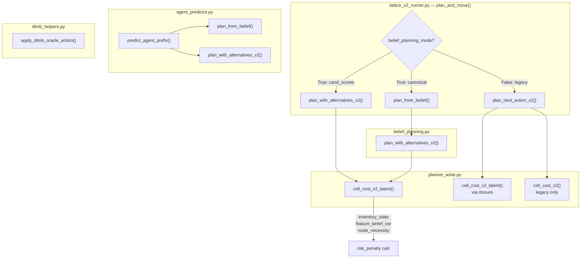

# 批次 A：P0 结果正确性热修复 — 调查报告

> 调查范围：A1–A5 + 横向冗余分析  
> 日期：2026-04-07  
> 原则：只核对链路、证明影响、比较方案，不改主线代码

---

## Part A. 执行路径总图

### A.1 五层调用关系



### A.2 路径分类

| 路径 | 代码入口 | 类型 | 是否进入主实验 |
|------|---------|------|--------------|
| ① Runner → `plan_from_belief` → `plan_with_alternatives_v2` → `cell_cost_v2_latent` | L465-478 | **Canonical** | ✅ 所有实验脚本都用 `belief_planning_mode=True` |
| ② Runner → `plan_with_alternatives_v2` (cand_scores, L486-492) | L484-495 | **Canonical** (诊断) | ✅ 同上 |
| ③ Runner → `plan_next_action_v2` → `cell_cost_v2_latent` | L497-504 | **Legacy** | ❌ default=False，0/49+ 个实验脚本使用 |
| ④ Tutor → `predict_agent_prefix` → `plan_from_belief` → `plan_with_alternatives_v2` | agent_predictor.py L62 | **Canonical** (tutor side) | ✅ 通过 `score_interventions` |
| ⑤ Tutor → `predict_agent_prefix` → `plan_with_alternatives_v2` (cand_scores) | agent_predictor.py L78 | **Canonical** (tutor side) | ✅ 同上 |
| ⑥ DTMB oracle → `apply_dtmb_oracle_action` | L624-628 | **Oracle/debug** | 🟡 仅 `tutor_mode="dtmb_oracle"` |

> [!IMPORTANT]
> **关键发现**：所有 49+ 个实验脚本都使用 `belief_planning_mode=True`。路径 ③ (legacy `plan_next_action_v2`) **不进入任何主实验**。这改变了 A1 的优先级——legacy 路径的 bug 不影响已有结果，但 canonical 路径的 bug 全部影响。

---

## Part B. A1–A5 分项复核

---

### B.1 A1: shield / inventory_state 传递链

#### B.1.1 参数链路图

```
Runner plan_and_move()
├── belief_planning_mode=True (canonical):
│   ├── plan_from_belief()        ← ❌ 不接受 inventory_state
│   │   └── plan_with_alternatives_v2()  ← ✅ 签名有，但上游没传
│   └── plan_with_alternatives_v2() (cand_scores, L486)  ← ❌ 没传 inventory_state
│
├── belief_planning_mode=False (legacy, 不进入主实验):
│   └── plan_next_action_v2()    ← ❌ 不接受 inventory_state
│       └── cell_cost_v2_latent() closure  ← ❌ inventory=None
│
Tutor predict_agent_prefix():
├── plan_from_belief()            ← ❌ 同上，不传 inventory
│   └── plan_with_alternatives_v2()  ← ❌ 同上
└── plan_with_alternatives_v2() (cand_scores, L78)  ← ✅ 传了! (L88)
```

#### B.1.2 受影响文件与函数

| 文件 | 函数 | `inventory_state` 签名 | 调用时传入 |
|------|------|----------------------|----------|
| `planner_astar.py` L299 | `cell_cost_v2_latent()` | ✅ 接受 | —（被上层决定） |
| `planner_astar.py` L446 | `plan_with_alternatives_v2()` | ✅ 接受 (L461) | — |
| `planner_astar.py` L390 | `plan_next_action_v2()` | ❌ **不接受** | N/A |
| `belief_planning.py` L79 | `plan_from_belief()` | ❌ **不接受** | N/A |
| `lattice_v2_runner.py` L467 | Runner → `plan_from_belief` | N/A | ❌ **不传** |
| `lattice_v2_runner.py` L486 | Runner → `plan_with_alternatives_v2` | ✅ 签名有 | ❌ **不传** |
| `agent_predictor.py` L62 | Tutor → `plan_from_belief` | N/A | ❌ **不传** |
| `agent_predictor.py` L78 | Tutor → `plan_with_alternatives_v2` | ✅ | ✅ L88 传了 |

#### B.1.3 是否进入主线

**是。** `plan_from_belief()` 是 canonical path（路径①），所有实验脚本走这条路。

**影响**：当 agent 持有 shield 时：
- `cell_cost_v2_latent` L363-364: `risk_penalty_full *= (1.0 - shield_risk_reduction)` 不会触发
- Agent 真规划的 risk penalty **不会因 shield 而降低**
- 但 execution 时（runner L530-531）shield **会实际减少 risk**
- **规划 ≠ 执行**：agent 在规划时高估了 risk（因为不知道自己有 shield），但执行时 shield 确实保护了它

#### B.1.4 实际影响级别

**中。** 分析：
- `shield` 只在 ITEM_DROP 之后存在（tutor 发了 ITEM_DROP 才有 shield）
- 此时 agent 已经处于 belt 附近（ITEM_DROP 的触发条件要求 agent 接近 belt）
- 规划高估 risk → agent 可能偏向更保守的选择（多绕路），但因为 belt 通常是 near-unavoidable，偏保守不一定改变 action
- Tutor 的 `predict_agent_prefix_after_item_drop` 走 `predict_agent_prefix` → `plan_from_belief`，**也没传 inventory**，所以 tutor 对 "ITEM_DROP 后 agent 行为" 的预测也不考虑 shield → tutor 高估 ITEM_DROP 的残余 risk

#### B.1.5 双标准确认

**确认存在"双标准"**：

| 路径 | 是否考虑 shield |
|------|--------------|
| Runner → `plan_from_belief` (决定真实 action) | ❌ 不考虑 |
| Runner → `plan_with_alternatives_v2` (cand_scores) | ❌ 不考虑 |
| Tutor → `plan_from_belief` (counterfactual) | ❌ 不考虑 |
| Tutor → `plan_with_alternatives_v2` (WAIT cand_scores) | ✅ 考虑 |
| Tutor → `predict_agent_prefix_after_item_drop` → predict_agent_prefix | ❌ 不考虑（inventory_state 参数传了但 `plan_from_belief` 不接受）|
| Runner → execution (真实 risk resolution) | ✅ 考虑 |

精确描述：`predict_agent_prefix_after_item_drop` 创建了 `cf_inventory`，传给了 `predict_agent_prefix(inventory_state=cf_inventory)`，但 `predict_agent_prefix` L62-75 调 `plan_from_belief` 时**无法转发**（因为 `plan_from_belief` 没有 `inventory_state` 参数），只有 L78-88 的 `plan_with_alternatives_v2` cand_scores 那条路正确传递了。

#### B.1.6 修复建议

**方案 A：最小补参数（推荐先做）**

修改 2 个文件 3 处：
1. `belief_planning.py:plan_from_belief()` — 加 `inventory_state=None` 参数，透传给 `plan_with_alternatives_v2`
2. `lattice_v2_runner.py:467` — `plan_from_belief(... inventory_state=s.inventory)`
3. `lattice_v2_runner.py:486` — `plan_with_alternatives_v2(... inventory_state=s.inventory)`

不需要改 `plan_next_action_v2`（legacy 路径没有实验使用它）。

**方案 B：统一 planner 输入结构（后续方向）**

值得作为 P1 方向。一个 `PlannerContext` dataclass 收拢所有输入。但当前不急。

#### B.1.7 `plan_next_action_v2` 应归档

`plan_next_action_v2` 在 legacy path（`belief_planning_mode=False`）中使用。0/49+ 实验脚本使用该路径。建议：
- **不修它**（浪费精力）
- 添加 `# DEPRECATED: legacy path, not used in canonical experiments` 注释
- 后续清理时可以删除

---

### B.2 A2: tutor counterfactual 与真实 planner 的输入不一致

#### B.2.1 完整输入对比表

| 输入 | Runner 真规划 (plan_from_belief L467) | Tutor counterfactual (predict_agent_prefix L62) | 差异 |
|------|---------------------------------------|------------------------------------------------|------|
| `belief_mean` | `s.feature_belief.mean` | `rb.agent_belief_mean` | ⚠️ `rb` 是 deepcopy snapshot，可能有 stale lag |
| `belief_var` | `s.feature_belief.var` (L476) ✅ | ❌ **不传** | 🔴 Tutor 用 Hessian-based uncertainty |
| `latent_predictor` | `s.latent_predictor` | `surrogate_lp = deepcopy(rb.predictor)` | ✅ 设计如此（surrogate） |
| `lambda_risk` | 函数默认 = **3.0** (belief_planning.py L91) | `rb.agent_risk_weight` = **3.0** (默认) | ✅ 一致 |
| `lambda_c` | 函数默认 = **1.0** | `rb.agent_lambda_c` = **1.0** | ✅ 一致 |
| `lambda_uc` | 函数默认 = **0.1** | `rb.agent_lambda_uc` = **0.1** | ✅ 一致 |
| `lambda_ur` | 函数默认 = **0.1** | `rb.agent_lambda_ur` = **0.1** | ✅ 一致 |
| `route_necessity` | 真实计算 (L458-461) ✅ | ❌ **函数默认 = 0.0** | 🔴 Tutor 始终 1-n=1.0, 高估 uncertainty |
| `inventory_state` | ❌ 不传（见 A1） | ❌ 不传 | 一致但都错 |
| `search_budget` | 30 | `rb.agent_search_budget` (default 30) | ✅ 一致 |
| `t, t_max` | `s.t, s.t_max` | `t, t_max` 参数传入 | ✅ 一致 |

#### B.2.2 runner 自身的隐式默认值问题

**关键发现**：Runner L467 调 `plan_from_belief()` 时**不传 lambda_risk/lambda_c 等权重**，依赖函数默认值。

```python
# Runner L467-478 — 没有传任何 lambda 权重
bp = plan_from_belief(
    s.agent_pos, s.goal, s.belief_cost, s.feature_belief.mean,
    s.risk_head, s.passable,
    latent_predictor=s.latent_predictor,
    warned_cell_extra=extra,
    search_budget=30,
    prefix_horizon=...,
    confidence_temperature=...,
    t=s.t, t_max=s.t_max,
    feature_belief_var=s.feature_belief.var,   # ← 这个传了
    route_necessity=route_necessity,            # ← 这个传了
)
```

`plan_from_belief` 的默认值是 `lambda_risk=3.0, lambda_uncertainty=0.5`。

而 Runner L486 的 `plan_with_alternatives_v2` 调用也不传 `lambda_*`，使用 **该函数** 的默认值：`lambda_risk=5.0, lambda_uncertainty=0.1`。

> [!CAUTION]
> **Runner 内部双标准**：L467 `plan_from_belief`(主规划) 用 λ_r=3.0, λ_u=0.5；L486 `plan_with_alternatives_v2`(cand_scores/failure_modes) 用 λ_r=5.0, λ_u=0.1。**同一次 plan_and_move() 调用中，主计划和候选评估用了不同的权重。**

#### B.2.3 `feature_belief_var` 缺失的影响

`cell_cost_v2_latent` L344-350:
```python
if feature_belief_var is not None:
    cost_unc = latent_predictor.predict_cost_uncertainty_from_var(x_var)  # posterior
    risk_unc = latent_predictor.predict_risk_uncertainty_from_var(x_var)  # posterior
else:
    cost_unc = latent_predictor.predict_cost_uncertainty(x_belief)  # Hessian
    risk_unc = latent_predictor.predict_risk_uncertainty(x_belief)  # Hessian
```

Tutor 走 `else` 分支（Hessian approximation），Runner 走 `if` 分支（posterior variance propagation）。两种方法算出的 uncertainty 在早期（n_updates < 10）可能差异 **2-5×**。

**评估**：`route_necessity` 缺失的影响更关键。因为 tutor 的 necessity=0.0 → `(1-n)=1.0` → uncertainty penalty 全量生效。而 runner 在某些状态下 necessity 可达 0.5-0.8，大幅折扣 uncertainty。这意味着 **tutor 系统性高估 uncertainty penalty**，导致 WAIT 的 expected utility 被拉低。

#### B.2.4 影响级别

| 不一致项 | 影响 | 级别 |
|---------|------|------|
| `feature_belief_var` 缺失 | Tutor uncertainty 计算方法不同 | **中** — 两种方法趋向同一极限 |
| `route_necessity` 缺失 | Tutor 高估 uncertainty penalty ~30-80% | **高** — 系统性偏差 |
| `inventory_state` 缺失 | Shield 不进入规划 | **中** — 仅 ITEM_DROP 之后 |
| Runner 两个调用点 λ 不一致 | 内部双标准 | **低** — cand_scores 只用于 failure_modes 诊断 |

#### B.2.5 修复建议

**方案 A（推荐先做）**：
1. `predict_agent_prefix`: 增加 `feature_belief_var`, `route_necessity` 参数，透传到 `plan_from_belief`
2. Runner L486: 统一使用 `plan_from_belief` 的权重默认值（或显式传入相同权重）
3. `plan_from_belief`: 增加 `inventory_state` 参数（与 A1 合并）

**方案 B（后续 P1）**：
创建 `PlannerConfig` dataclass 统一 `lambda_c/r/uc/ur`，runner 初始化时构造一次，传给 agent 和 `RobotBelief`。消除命名混乱和默认值漂移。

**方案 C（更远）**：
Planner adapter 模式。当前不急。

#### B.2.6 冗余判断

| 名称 | 指代 | 是否实质影响行为 |
|------|------|--------------|
| `lambda_risk` (planner) vs `lambda_r` (cell_cost_v2_latent) | 同一个量 | **命名问题**，不影响（cell_cost_v2_latent 内部转发正确） |
| `lambda_uncertainty` (plan_from_belief) vs `lambda_uc/lambda_ur` | 不同：前者是 legacy 单权重，后者分 cost/risk | **实质影响**：plan_from_belief 默认 λ_u=0.5 但不用它——透传 `lambda_uc=0.1, lambda_ur=0.1` |
| `agent_risk_weight` (RobotBelief) | 和 `lambda_risk` 相同 | **命名问题**，不影响当前行为 |
| Latent path 下 `belief_cost` | 完全冗余（cell_cost_v2_latent 不用） | **冗余传参**，建议标 Optional |

---

### B.3 A3: NaN / Inf safety guard

#### B.3.1 NaN 保护现状

| 组件 | `np.isfinite(grad_norm)` check | 安全吗 |
|------|-------------------------------|--------|
| `BayesianCostHead.update_from_label` | ✅ L90 | ✅ |
| `BasisCostHead.update_from_label` | ✅ L155 | ✅ |
| `BayesianRiskHead.update_from_label` | ❌ **缺失** L96 | 🔴 |
| `BasisRiskHead.update_from_label` | ❌ **缺失** L232 | 🔴 |
| `cell_cost_v2_latent` output | ✅ L353-354 + L387 | ✅ (NaN prediction → 10.0 fallback) |
| planner A* | ✅ (isinf check in passable) | ✅ |

#### B.3.2 NaN 传播路径

```
极端 x → BayesianRiskHead.update_from_label
  → grad_w = -error * x * weight + w/prior_var
  → grad_norm = NaN (if x contains very large values after many updates)
  → 不检查 isfinite → grad_norm > max_grad_norm 为 False (NaN comparison)
  → w -= lr * grad_w → w 变成 NaN
  → predict_risk() → NaN
  → cell_cost_v2_latent() → 触发 NaN check L353 → fallback 10.0
```

**结论**：NaN 在 **weight** 层面传播，但在 **prediction** 层面被 `cell_cost_v2_latent` 的 NaN guard 兜住了。所以当前不是 silent crash，而是 **prediction 退化为固定值 10.0**（所有 cell 同 cost），planner 退化为 Manhattan distance。

#### B.3.3 影响级别

**中。** 不会 crash，但会导致 predictor silently 失效。在大规模实验中可能表现为 "某些 seed 的学习曲线突然平坦"。

#### B.3.4 是否有测试检查 finiteness

grep 结果：**0 个测试** 显式检查 predictor 参数的 finiteness。

#### B.3.5 修复建议

**方案（只需要一层 guard）**：

在 `BayesianRiskHead.update_from_label` L96 和 `BasisRiskHead.update_from_label` L232 加 `if not np.isfinite(grad_norm): return`，和 cost head 保持一致。

这是 2 行修改，零风险，立即生效。

- 不需要 prediction output assert（已有 L353）
- 不需要 episode-level counter（调试便利但不是必须的）

---

### B.4 A4: SlowFast 生命周期接入

#### B.4.1 runner 中 latent_predictor 的生命周期

```python
# lattice_v2_runner.py reset() ~ L290-320
lp = LatentCostRiskHead(d=4, ...)  # 或 StructuredBasisCostRiskHead
state.latent_predictor = lp

# 没有任何地方调 begin_episode() 或 end_episode()
# grep "begin_episode|end_episode" in lattice_v2_runner.py → 0 results
```

**Runner 创建 predictor → 用到 episode 结束 → 丢弃。**
没有跨 episode 的 state 持久化。

#### B.4.2 脚本中的手动 lifecycle

```python
# scripts/task4_slowfast_shadow.py L53-80 (手动)
# scripts/test_generic_slowfast.py L116-150 (手动)
# 这些脚本自行管理 begin/end episode
```

**结论**：SlowFast 机制只在 2 个 script 中手动生效。主 runner pipeline 不支持。

#### B.4.3 `end_episode()` 只同步 w,b 不同步统计量

```python
# slow_fast_head.py L149-152
self._slow.cost_head.w[:] = new_wc    # ✅ w 同步
self._slow.cost_head.b = float(new_bc)  # ✅ b 同步
# ❌ 没有: self._slow.cost_head.xx_sum
# ❌ 没有: self._slow.cost_head.xy_sum
# ❌ 没有: self._slow.cost_head.n_updates
```

**影响**：slow head 的 uncertainty 实现（`predict_uncertainty`）依赖 `xx_sum` 和 `n_updates`。如果不同步：
- slow head 的 `n_updates = 0` → uncertainty 始终返回最大值（1.0 for cost, 0.25 for risk）
- `begin_episode` 把 slow copy 到 fast → fast 起始 uncertainty 也是最大值
- 相当于 **每 episode fast 都从最大 uncertainty 开始**，slow 的 uncertainty 永远不改善
- w,b 的 EMA 确实在改善 prediction accuracy，但 **uncertainty 不跟随改善**

这对规划的具体影响：`cell_cost_v2_latent` 中 `learning_factor = min(1.0, n_updates / 10.0)` 每 episode 从 0 重新开始 → 前 10 步始终用 necessity discount。SlowFast 的 "warm start" 只体现在 point prediction，不体现在 uncertainty。

#### B.4.4 影响级别

**高（对 transfer 实验而言）。** Transfer learning 是 Proposal 三大指标之一。当前不可用。

#### B.4.5 修复建议

**方案 A（推荐先做）：最小 runner lifecycle 接入**

```python
# lattice_v2_runner.py reset() — 在 predictor 创建后
if hasattr(state.latent_predictor, 'begin_episode'):
    state.latent_predictor.begin_episode()

# lattice_v2_runner.py — 新增 end_episode hook
# 在 episode 结束后（run_episode 返回前或外部循环中）
if hasattr(state.latent_predictor, 'end_episode'):
    state.latent_predictor.end_episode()
```

同时修复 `end_episode()` 的统计量同步：
```python
# slow_fast_head.py end_episode() — 追加
self._slow.cost_head.xx_sum[:] = (1-α) * self._slow.cost_head.xx_sum + α * self._fast.cost_head.xx_sum
self._slow.cost_head.n_updates = max(self._slow.cost_head.n_updates, self._fast.cost_head.n_updates)
# 同理 risk_head
```

**方案 B（后续）**：统一 predictor lifecycle hook → 所有 predictor type 都能接入。

#### B.4.6 `transfer_eval.py` 的 manual w-copy

当 runner lifecycle 修完后，`transfer_eval.py` 中的 `snapshot_learned_params` / `apply_learned_params`（手动 `w[:] = ...`）可以被 `deepcopy(predictor)` / `restore_predictor` 替代。建议标 deprecated，等 Phase 3A 正式清理。

---

### B.5 A5: DTMB / ITEM_DROP helper 层问题

#### B.5.1 DTMB helper 主线使用情况

`apply_dtmb_oracle_action` 只在 `tutor_mode="dtmb_oracle"` 时被调用（runner L624-628）。

**主线实验配置**：大部分 DTMB 实验使用 `tutor_mode`="robot_belief" + 标准 `score_interventions` 管线。`dtmb_oracle` 是 **对照组模式**，用于验证 "如果 tutor 有完美信息会怎样"。

**结论**：oracle 路径不是主线，但它是重要的对照实验路径。Bug 会影响对照组数据的可信度。

#### B.5.2 `active_duration` 幽灵属性

```python
# dtmb_helpers.py L293
already_shielded = getattr(s.inventory, 'active_duration', 0) > 0
```

`InventoryState` 实际 API：
```python
class InventoryState:
    shield: int = 0            # shield count
    shield_risk_reduction: float = 0.5
    def has_shield(self) -> bool
    def add_shield(self)
    def consume_shield(self)
    # 没有 active_duration 属性
```

`getattr(s.inventory, 'active_duration', 0)` 始终返回 0 → `already_shielded = False` → oracle 可能重复触发 ITEM_DROP。

**影响级别**：**低-中**。oracle 重复 ITEM_DROP 在 monkey-patch `_dtmb_oracle_item_dropped` L294-295 被第二层 check 拦住。所以实际不会重复。但代码意图错误。

#### B.5.3 broken import

```python
# dtmb_helpers.py L375
from src.agents.pragmatic_warning import InterventionDecision
```

这是**绝对 import**（`src.agents.`）而非相对 import（`..agents.`）。在非 `src` 为 root 的项目结构下会 `ImportError`，被 L377 的 `except (ImportError, AttributeError): pass` 吞掉。

**影响**：`s.last_intervention` 不会被设置 → 下游 metrics 可能缺失 oracle 干预记录。

**修复**：改为 `from ..teachers.interventions import InterventionDecision` 或类似正确路径。

#### B.5.4 ground-truth risk mutation

```python
# dtmb_helpers.py L369-370
s.gridmap.true_risk[br, bc] *= 0.15  # oracle shield effect
```

**这违反了核心语义**：ITEM_DROP 应该是 affordance provision（给 agent 一个 shield 工具），不应该改变环境的 true risk。修改 `true_risk` 意味着即使 shield 被消耗了，cell 的风险也永久降低了。

**触发条件**：仅当 `s.inventory is None` 时（即 runner 没有初始化 inventory system）。在正确配置的 DTMB 实验中（`item_drop_enabled=True` → inventory 存在），**不会触发**。这是 fallback/临时代码。

**影响级别**：**低**（正确配置不触发），但**语义违规严重**（应该直接封死）。

#### B.5.5 修复建议

**方案 A（推荐）：最小热修 3 行**

1. L293: `already_shielded = getattr(s.inventory, 'active_duration', 0) > 0` → `already_shielded = s.inventory.has_shield() if (hasattr(s, 'inventory') and s.inventory is not None) else False`
2. L375: `from src.agents.pragmatic_warning import InterventionDecision` → 正确 import 或内联 fallback
3. L366-370: 在 `s.inventory is None` 分支加 `warnings.warn("DTMB oracle: no inventory, skipping ITEM_DROP")`，不改 true_risk

**方案 B（轻量重构，后续 P1）**：
把 monkey patch 字段 `_dtmb_oracle_warned`, `_dtmb_oracle_item_dropped` 移入 `V2EpisodeState` 的显式字段。

---

## Part C. 测试设计草案

### C.1 单元测试

| 测试 | 目标 | 文件 |
|------|------|------|
| `test_shield_enters_planning` | 验证 `cell_cost_v2_latent` 在 `inventory_state.has_shield()=True` 时 risk penalty 按 `(1-0.5)` 衰减 | 已有 `test_planner_v2.py` 可扩展 |
| `test_risk_head_nan_guard` | 构造 extreme x → update → assert w finite | 新文件 `test_nan_safety.py` |
| `test_slowfast_lifecycle` | 2 episode → assert slow head w 变化 | 扩展 `test_cost_risk_model.py` |
| `test_tutor_var_propagation` | 给 predict_agent_prefix 传 feature_belief_var → 验证走 posterior 分支 | 扩展 `test_agent_predictor.py` |

### C.2 最小场景行为测试

| 测试 | 场景 | 验证点 |
|------|------|--------|
| `test_shield_planning_effect` | 单 belt 场景 + 有/无 shield | plan 的 expected_risk 在 shield 模式下应约等于 0.5× |
| `test_agent_tutor_action_match` | 同 belief 同 predictor | agent 和 tutor top-1 action 应一致（修复后） |
| `test_necessity_effect` | high necessity 场景 | uncertainty penalty 应明显低于 necessity=0 |

### C.3 小规模 smoke

| 测试 | 参数 | 检查 |
|------|------|------|
| `smoke_baseline_5seed` | baseline_v2, 5 seed | 所有 predictor params finite at episode end |
| `smoke_dtmb_item_drop` | DTMB, 3 seed | `true_risk` 不变，inventory 正确 |
| `smoke_slowfast_2ep` | 2 episode sequence | slow w ≠ 0 after ep2 |

### C.4 回归测试

修后重跑 `task3_gtet_z_regression.py` (20 seeds × 3 families) 确认行为一致/合理变化。关键指标：survival_rate, mean_risk_entered, warn_count.

---

## Part D. 冗余与清理建议

### D.1 立刻修（与批次 A 合并）

| 项 | 类型 | 修复 |
|----|------|------|
| `BayesianRiskHead.update_from_label` 缺 isfinite guard | 真实 bug | 加 1 行 |
| `BasisRiskHead.update_from_label` 缺 isfinite guard | 真实 bug | 加 1 行 |
| `plan_from_belief` 不接受 `inventory_state` | 真实 bug | 加参数+透传 |
| Runner L467 不传 inventory_state | 真实 bug | 加 1 行 |
| Runner L486 不传 inventory_state | 真实 bug | 加 1 行 |
| `dtmb_helpers.py` L293 `active_duration` | 真实 bug | 改 1 行 |

### D.2 先留着但标 deprecated

| 项 | 原因 |
|----|------|
| `plan_next_action_v2()` | Legacy path，0 个实验使用。标注 `# DEPRECATED` |
| `cell_cost_v2()` | V0 path。不删但标注 |
| `transfer_eval.py` manual w-copy | 等 lifecycle 修完后用 `deepcopy` 替代 |
| `warned_lane_bias` in runner state | RSA 路径下永远为空。标注 |
| `lambda_uncertainty` in `plan_from_belief` | 透传了 `lambda_uc/ur` 后这个参数冗余。标注 |

### D.3 可以归档删除

| 项 | 原因 |
|----|------|
| `observation_model.py` V0 path (88行) | 标记 DEPRECATED，无调用者 |
| `plan_next_action()` (V0，非 V2) | 无调用者 |
| `bounded_astar()` (V0) | 无调用者 |
| `dtmb_helpers.py` L366-370 true_risk mutation | 语义违规，应换成 skip+warning |
| `scenario_families.py` 第一版 `generate_delayed_corridor`(L911) | 被第二版覆盖，死代码 |
| `scenario_families.py` 第一版 `generate_distractor_cue`(L1117) | 被第二版覆盖，死代码 |

---

## 硬问题回答

### 1. `inventory_state` 漏传到底影响哪些模式，是否已经进入主线结果？

**是的，已经进入主线。** 所有实验走 `belief_planning_mode=True` → `plan_from_belief` → 不传 inventory。Shield 在 **规划阶段** 被忽略。但因为 belt 通常是 near-unavoidable，agent 即使高估 risk 也得到穿 belt，所以行为差异被拓扑约束掩盖了。**ITEM_DROP 实验的 "gain" 被低估**，因为 tutor 认为 ITEM_DROP 后 agent 的规划没变（shield 不进入规划）。

### 2. `feature_belief_var` 和 `route_necessity` 哪个对 action mismatch 更关键？

**`route_necessity` 更关键。** Var 影响 uncertainty 的 计算方法（posterior vs Hessian），两种方法量级大致相同。但 necessity 影响 uncertainty 的 权重乘子（`(1-n)=1.0` vs `(1-n)≈0.3`），是 3× 的差异。

### 3. planner weights 不一致是"风格差异"还是"真实行为差异"？

**目前是形式问题而非行为问题。** Runner L467 和 L486 使用不同默认值（3.0/0.5 vs 5.0/0.1），但 L486 的 cand_scores 只用于 failure_mode 诊断，不影响 action 选择。Tutor 的 RobotBelief 默认值（3.0/0.5）与 `plan_from_belief` 默认值一致。**但 runner → 它自己 的两次调用用了不同权重，这是内部不一致。**

### 4. SlowFast 修完 lifecycle 后，`xx_sum / n_updates` 是否必须同步？

**是的，必须同步。** 否则每 episode 的 `learning_factor = min(1.0, n_updates/10)` 都从 0 开始，前 10 步完全忽略 risk prediction 的 epistemic 部分（全靠 necessity discount），即使 slow head 的 w 已经很准了。 point prediction 改善但 uncertainty 不改善 = transfer 只有一半生效。

### 5. DTMB helper 的 oracle 改真值逻辑是否应该直接封死？

**是的，应该封死。** 正确配置的实验不会触发它（inventory 存在时走 `add_shield()`）。但它违反 "teacher 不修改 ground truth" 的核心语义。替换为 `warnings.warn + skip` 即可。不需要 "fallback to direct risk reduction" 这个选项。

### 6. 哪些 legacy / workaround 可以在第二步修复时顺手归档？

见 Part D.3。最高价值的归档是 `scenario_families.py` 中两组重复函数定义（~800 行死代码）。

### 7. 哪个修法在"最小 diff / 最强鲁棒 / 最少冗余"之间最平衡？

**方案 A（最小补参数）是当前最佳选择。** 具体修改面：

| 文件 | 改动行数 | 改动内容 |
|------|---------|---------|
| `belief_planning.py` | +2 行 | 加 `inventory_state` 参数，透传 |
| `lattice_v2_runner.py` | +3 行 | 传 `inventory_state` × 2, 传 route_necessity 到 tutor 链路 |
| `agent_predictor.py` | +2 行 | 传 `feature_belief_var=rb.agent_belief_var` |
| `risk_model.py` | +2 行 | isfinite guard |
| `structured_basis_head.py` | +2 行 | isfinite guard |
| `dtmb_helpers.py` | +3 行 | active_duration fix, import fix, true_risk fence |
| `slow_fast_head.py` | +6 行 | end_episode 同步统计量 |

**总计约 20 行修改，0 个新超参数，0 个结构变化。**

后续 P1 方向：`PlannerConfig` dataclass 统一权重来源 → 根治命名混乱和默认值漂移。这和方案 A 不冲突——A 先堵住当前 bug，后续再清理接口。
