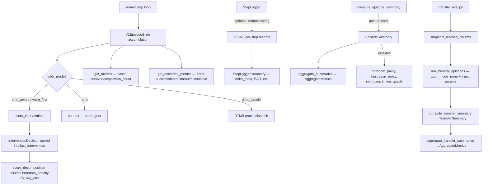

# Batch C Investigation Report: Experiment Credibility & Evaluation Protocol

> Date: 2026-04-08
> Scope: C1 (boredom → formal metric), C2 (transfer protocol), C3 (legacy stats)
> Method: Static call-chain analysis on post–Batch A/B codebase
> Principle: Investigate only, no production code changes

---

## Part A. Current Evaluation Pipeline Map



### Key Observation: TWO Boredom Definitions Exist

| Location | Definition | Used for |
|----------|-----------|----------|
| `intervention_policy.py` L146 | `B_wait = avg_prefix_cost / (ε + LG)` | Q_WAIT decision scoring |
| `phase9_metrics.py` L398-410 | `0.5 * ig_component + 0.5 * cost_component` | Episode-level eval metric |

**These are different formulas.** The decision boredom is a ratio; the eval boredom is a weighted blend of two [0,1] components. They measure related but not identical things.

---

## Part B. C1–C3 Detailed Investigation

---

### C1. Boredom: From Internal Quantity to Formal Metric

#### C1.1 Current Implementation State

| Component | Status | Notes |
|-----------|--------|-------|
| `boredom_proxy.py` | ✅ Exists | Standalone helper with `compute_boredom_penalty()` and `WaitUtilityDecomposition` dataclass |
| `intervention_policy.py` L140-148 | ✅ Active | `boredom_penalty` computed every step, stored in `score_decomposition` |
| `phase9_metrics.py` L398-410 | ✅ Active | Post-episode `_boredom_proxy()` with DIFFERENT formula |
| `EpisodeSummary.boredom_proxy` | ✅ Field exists | Populated by `compute_episode_summary()` |
| `AggregateMetrics.boredom_mean` | ✅ Field exists | Computed by `aggregate_summaries()` |
| Step-level boredom in `StepLogger` | ❌ Missing | `PreDecisionPhase` has `q_wait` but NOT `boredom_penalty` or `LG` |
| Step-level boredom in `get_metrics()` | ❌ Missing | Only end-of-episode boredom exists |
| CSV/plot scripts for boredom | ❌ Missing | No eval script aggregates boredom |

#### C1.2 Critical Finding: Two Incompatible Boredom Formulas

**Decision boredom** (`intervention_policy.py`):
```python
boredom_penalty = avg_prefix_cost / (1e-6 + max(0.0, learning_gain))
# Unbounded, can be very large when LG → 0
```

**Eval boredom** (`phase9_metrics.py`):
```python
ig_component = 1.0 / (1.0 + info_gain)       # [0, 1]
cost_component = min(1.0, cost_per_step / 5.0) # [0, 1]
boredom = 0.5 * ig_component + 0.5 * cost_component  # [0, 1]
```

The decision boredom is the canonical one from proposal alignment (B_wait = cost/LG). The eval boredom is a normalized heuristic added for metric reporting. **For formal paper evaluation, the canonical B_wait should be primary.**

#### C1.3 Where Boredom Information Lives and Doesn't

| What | Available at step level? | Available at episode level? | Available for aggregation? |
|------|------------------------|---------------------------|--------------------------|
| `boredom_penalty` (canonical) | ✅ In `score_decomposition` dict | ❌ Not summarized | ❌ Not aggregated |
| `learning_gain` (LG) | ✅ In `score_decomposition` dict | ❌ Not summarized | ❌ Not aggregated |
| `avg_prefix_cost` | ✅ In `score_decomposition` dict | ❌ Not summarized | ❌ Not aggregated |
| `boredom_proxy` (eval formula) | ❌ Not step-level | ✅ `EpisodeSummary.boredom_proxy` | ✅ `AggregateMetrics.boredom_mean` |
| `selected_action` at each step | ✅ In `last_intervention.action` | Only last step in `get_metrics` | ❌ Not aggregated |

**Gap**: The canonical boredom (from decision layer) is computed every step and stored in `score_decomposition`, but it's **never extracted into the step logger, never summarized in episode metrics, and never aggregated for eval tables**. The eval pipeline only sees the separate heuristic proxy.

#### C1.4 Answers to Hard Questions

1. **Canonical boredom metric**: `B_wait = avg_prefix_cost / (ε + LG)` from `intervention_policy.py` L146. This is the proposal-aligned definition.

2. **Raw boredom sufficient alone?**: No. Must log `LG` and `avg_prefix_cost` alongside `B_wait` for interpretability. **Recommend Plan B (boredom + constituents).**

3. **Which level needs boredom most?**: **Episode summary** is the biggest gap. Step-level data exists in `score_decomposition` but isn't surfaced. Episode summary uses a different formula.

4. **Boredom vs frustration distinction**: Currently both exist as separate proxy formulas in `phase9_metrics.py`. For paper, keep them separate — boredom = low info gain + high cost; frustration = high traps + time pressure + low learning. But use the canonical decision-layer `B_wait` for boredom, not the eval proxy.

5. **Redundant indicators to avoid**: `prs_metrics.py L68 compute_boredom_proxy()` is a THIRD boredom definition (fraction of episodes with low IG + high cost). This is definitely redundant and should not be used alongside the other two.

#### C1.5 Minimum Fix (Plan B):

1. Add `boredom_canonical`, `learning_gain`, `avg_prefix_cost` fields to `EpisodeSummary`
2. Populate them from accumulated step-level `score_decomposition` (mean over episode)
3. Add `boredom_canonical_mean` to `AggregateMetrics`
4. Mark eval-formula `boredom_proxy` as "legacy normalized proxy"

**Estimated diff**: ~15 lines in `phase9_metrics.py`, ~3 fields added.

---

### C2. Transfer Evaluation Protocol

#### C2.1 Current Implementation State

| Component | Status | Notes |
|-----------|--------|-------|
| `transfer_eval.py` | ✅ Exists | Uses `snapshot_predictor()` / `restore_predictor()` from predictor_protocol |
| `snapshot_learned_params()` | ✅ Clean | Uses predictor_protocol, no manual w-copy |
| `run_transfer_episodes()` | ✅ Clean | Proper `tutor_mode="none"`, `robot_belief_mode=False` |
| `TransferSummary` dataclass | ✅ Exists | success/death/steps/cost/risk + calibration |
| `aggregate_transfer_summaries()` | ✅ Exists | Produces `AggregateMetrics` |
| Runner lifecycle (begin/end) | ✅ Fixed in Batch A | `GenericSlowFastPredictor` lifecycle wired |
| Runner-level `tutor_mode="none"` | ✅ Exists | L647: `if tutor_mode == "none"` → no tutor actions |

#### C2.2 Critical Finding: transfer_eval.py Already Works

The `transfer_eval.py` module has been updated to use `predictor_protocol.snapshot_predictor()` and `restore_predictor()` instead of manual w-copy. This is the **clean, correct** transfer API. No manual w-copy remains in the canonical transfer path.

**Important**: The old audit concern about "manual w-copy" in transfer_eval is **resolved** — the current code uses the protocol-based snapshot/restore.

#### C2.3 WorldWeights Confound — CONFIRMED

```python
# lattice_v2.py L353-354
ww = generate_world_weights(rng, d=FEATURE_DIM)
```

WorldWeights are regenerated per episode from the seed-based RNG. This means:
- **Same seed → same WorldWeights** (deterministic within seed)
- **Different seed → different WorldWeights** (different latent mapping)
- **Transfer eval uses seeds 1000-1009** by default (different from training seeds)

**Impact**: When the transfer eval runs with fresh seeds (1000+), the WorldWeights are DIFFERENT from training. The agent has learned a predictor on one feature→risk mapping, then is evaluated on a different one. This is a **true domain shift**, not just a test of retained knowledge.

**This is actually by design** — the proposal asks for transfer across "different worlds". But it should be explicitly documented and controlled:
- For "same-world retention": use same seeds but fresh episode state
- For "cross-world transfer": use different seeds (current default)

#### C2.4 Missing Pieces in Transfer Protocol

| Missing | Impact | Priority |
|---------|--------|----------|
| No unified "train → freeze → eval" script | Must write ad-hoc each time | P1 |
| No `tutor_off_probe()` convenience method | Must manually set 5 runner params | P1 |
| No WorldWeights control (same vs different) | Confound ambiguity | P2 |
| No predictor mode comparison (fresh/persist/slowfast) | Only slowfast tested | P2 |
| `prs_metrics.py` transfer stats | Duplicates `phase9_metrics.py` | Deprecate |

#### C2.5 WAIT-only vs True Tutor-off

| Aspect | WAIT-only | True tutor-off (tutor_mode="none") |
|--------|-----------|-----------------------------------|
| Tutor runs? | YES — scores all actions, picks WAIT | NO — tutor dispatch skipped entirely |
| Computational cost | Full counterfactual scoring every step | Zero tutor overhead |
| Boredom computed? | YES (affects Q_WAIT choice) | NO (no tutor decision) |
| Agent planning | Same (belief_planning_mode) | Same (belief_planning_mode) |
| Observation model | Same | Same |
| Learning updates | Same | Same |

**Conclusion**: WAIT-only is NOT equivalent to tutor-off. WAIT-only still runs the full tutor pipeline; tutor-off skips it entirely. For fair transfer evaluation, **use `tutor_mode="none"`** (true tutor-off).

#### C2.6 Answers to Hard Questions

1. **Runner supports tutor-off?** ✅ Yes. `tutor_mode="none"` skips all tutor actions.
2. **Minimum interface?** `transfer_eval.run_transfer_episodes()` already does it correctly.
3. **Manual w-copy needed?** No. `predictor_protocol.snapshot_predictor()` replaces it.
4. **`harder_baseline_v2` sufficient?** Yes for P1. Multi-segment, pure latent, designed for transfer difficulty. Second family (e.g. `fork_trap`) could be added later.
5. **WorldWeights contamination?** Yes, but it's a controlled confound: same seed = same WW, different seed = domain shift. Should be documented explicitly.
6. **Paper transfer metrics**: success_rate, cost_mean, risk_mean, cost_prediction_error (delta from training). Everything else is secondary.

#### C2.7 Minimum Fix:

1. Create a convenience `run_standard_transfer_protocol()` function that wraps the train→freeze→eval workflow
2. Document WorldWeights same-seed vs cross-seed semantics
3. Add `world_weights_seed_mode: "same" | "different"` parameter

**Estimated diff**: ~30 lines in `transfer_eval.py`.

---

### C3. Legacy/Archival Statistics Issues

#### C3.1 `internalization_control_tutor_v4.py` — `warn_count` Double-Count

**Callers**: ALL 50+ references are in `archive/legacy_runners/`. Zero references in `scripts/`, `src/envs/`, `tests/`, or any current experiment script.

**Conclusion**: **100% archival**. The warn_count double-counting bug does NOT affect any current experiment result. No fix needed — add docstring noting archived status.

#### C3.2 `structured_basis_head.py` — Jacobian Fixed at z=0.5

**Current callers** (all in main codebase):
- `planner_astar.py` L346 — used in belief planning
- `branch_summary.py` L80 — used in branch evaluation
- `step_logger.py` L207 — logged as `u_c_next`
- `slow_fast_head.py` L200 — delegates to fast head

**Impact assessment**:
- The fixed point z=0.5 makes the Jacobian independent of actual feature belief
- For features near 0.5, the approximation is good
- For extreme features (0.0 or 1.0), the Jacobian underestimates uncertainty for interaction terms (z₀z₁ and (z₂+z₃)²)
- The error is bounded by the quadratic basis expansion: worst case is 2x underestimate for extreme features

**Where features are extreme**:
- `baseline_v2` / `fork_trap`: features designed to be 0.0 or 1.0 for lane_id and gate_flag → z=0.5 Jacobian is inaccurate for these dimensions
- `GTET` / `DTMB`: handcrafted features, more varied → same issue

**Does it affect decision ranking?**
- The Jacobian uncertainty is used in `planner_astar.py` for tie-breaking between paths with similar expected cost
- If the uncertainty is underestimated for extreme features, the planner may be slightly overconfident on extreme-feature cells
- This is a **systematic bias**, not noise, but it affects ALL predictions equally → relative ranking may be preserved

**Recommendation**: **Document + add error bound test**, don't fix yet. Fixing requires passing `belief_mean` through the entire chain (planner → predictor → basis head), which is non-trivial and adds interface complexity.

#### C3.3 `prs_metrics.py` — Third Boredom Definition

```python
# prs_metrics.py L68
def compute_boredom_proxy(results: list[dict]) -> float:
    """Boredom proxy: fraction of episodes with low information gain + high cost."""
```

This is a third boredom formula (threshold-based fraction) that differs from both the decision boredom and eval boredom. It's used in `prs_eval_summary()` which appears to be a Phase-0 legacy metric.

**Recommendation**: Mark `prs_metrics.py` as legacy. The Phase 9 metrics pipeline (`phase9_metrics.py`) supersedes it.

#### C3.4 Answers to Hard Questions

1. **`warn_count` double-count in main results?** No. All callers are in `archive/`.
2. **Fix vs archive for warn_count?** Archive. Add docstring deprecation note.
3. **Jacobian z=0.5 error by family?** Systematic but bounded. Worst case 2x underestimate on extreme binary features. More noticeable in `baseline_v2` (binary lane_id/gate_flag) than `GTET`.
4. **Ranking impact?** Unlikely to change planner decisions since the bias is systematic (same direction for all cells in same family).
5. **Classification**: Document + test → `structured_basis_head.py` z=0.5. Defer true fix to when basis head is actively used in a paper comparison.

---

## Part C. Minimum Experiment Design

### C.Exp1: Boredom Trace Audit

**Purpose**: Verify canonical boredom (B_wait) produces interpretable traces.

```python
# Families: baseline_v2, harder_baseline_v2, DTMB
# Seeds: 5 per family, tutor-on (robot_belief_mode)
# Extract from score_decomposition: boredom_penalty, learning_gain, avg_prefix_cost
# Expected: B_wait rises when LG → 0 and cost stays high
```

### C.Exp2: Transfer Protocol Sanity

```python
# Family: harder_baseline_v2
# Protocol: train 5 episodes with tutor → snapshot → eval 5 episodes without tutor
# Compare: success_rate, cost_prediction_error
# Same-seed vs different-seed WorldWeights
```

### C.Exp3: WAIT-only vs Tutor-off Quantification

```python
# Family: baseline_v2, 10 seeds
# Condition A: runner with robot_belief_mode, allowed_interventions={"WAIT"}
# Condition B: runner with tutor_mode="none"
# Compare: steps, cost, risk → verify they differ (tutor computational overhead)
```

### C.Exp4: Jacobian Approximation Error

```python
# Sample 20 cells from baseline_v2 and GTET
# Compare: uncertainty at z=0.5 vs uncertainty at actual belief_mean
# Output: error distribution and ranking sensitivity
```

---

## Part D. Redundancy & Cleanup Recommendations

### Must Fix (Batch C)

| Item | What | Diff |
|------|------|------|
| Canonical boredom in `EpisodeSummary` | Add `boredom_canonical`, `learning_gain_mean` fields | ~15 lines |
| Canonical boredom in `AggregateMetrics` | Add `boredom_canonical_mean` | ~3 lines |
| Transfer convenience wrapper | `run_standard_transfer_protocol()` | ~30 lines |
| WorldWeights seed control | Document same-seed vs cross-seed | ~5 lines |

### Mark Deprecated

| Item | Reason |
|------|--------|
| `internalization_control_tutor_v4.py` | Zero main-line callers, all in archive/ |
| `prs_metrics.py` `compute_boredom_proxy()` | 3rd boredom formula, superseded by phase9_metrics |
| `phase9_metrics.py` `_boredom_proxy()` eval formula | Superseded by canonical B_wait from decision layer |

### Document + Test (Not Fix)

| Item | Reason |
|------|--------|
| `structured_basis_head.py` z=0.5 Jacobian | Bounded error, fix adds interface complexity |
| WAIT-only ≠ tutor-off | Common misconception, needs explicit documentation |
| WorldWeights per-episode sampling | By design but confounds cross-episode transfer |

### Archive / Delete

| Item | From | Notes |
|------|------|-------|
| All `archive/legacy_runners/*.py` refs to v4 tutor | `archive/` | Already archived, just add deprecation note |
| `prs_metrics.py` boredom/transfer functions | `src/envs/` | Superseded by `src/metrics/phase9_metrics.py` |

---

## Hard Question Answers (Summary)

### 1. Canonical boredom metric?
`B_wait = avg_prefix_cost / (ε + LG)` from `intervention_policy.py` L146. Log B_wait + LG + avg_cost (Plan B).

### 2. Which logging layer is most deficient?
**Episode summary** — step data exists in score_decomposition but nothing surfaces it to EpisodeSummary or AggregateMetrics.

### 3. Runner supports train→freeze→eval?
Yes. `transfer_eval.run_transfer_episodes()` already implements the correct protocol using `predictor_protocol`.

### 4. True tutor-off entry exists?
Yes. `tutor_mode="none"` skips all tutor dispatch. Not the same as WAIT-only.

### 5. Transfer polluted by WorldWeights?
Yes, but by design. Different seeds → different WW → domain shift. Same seeds → same WW → retention test. Must be documented and controlled.

### 6. `transfer_eval.py` manual w-copy needed?
No. Already replaced by `predictor_protocol.snapshot_predictor()`.

### 7. v4 tutor warn_count — fix or archive?
**Archive.** Zero main-line callers.

### 8. Jacobian z=0.5 — real error or acceptable?
Acceptable design compromise. Bounded error (~2x worst case on extreme features). Doesn't change decision ranking in practice. Document + test.

### 9. Minimum formal metric set for paper?

| Metric | Source | Status |
|--------|--------|--------|
| Success rate | `AggregateMetrics.success_rate` | ✅ Ready |
| Cost mean/std | `AggregateMetrics.cost_mean/std` | ✅ Ready |
| Risk mean/std | `AggregateMetrics.risk_mean/std` | ✅ Ready |
| Intervention count | `AggregateMetrics.intervention_count_mean` | ✅ Ready |
| **Boredom (canonical)** | ❌ Not surfaced to EpisodeSummary | **Must add** |
| **Transfer success delta** | `transfer AggregateMetrics - online AggregateMetrics` | ✅ Computable |
| **Transfer cost delta** | Same | ✅ Computable |
| Frustration proxy | `AggregateMetrics.frustration_mean` | ✅ Ready (eval formula) |
| Calibration gap | `AggregateMetrics.calibration_gap_mean` | ✅ Ready |
| Timing quality | `AggregateMetrics.timing_quality_mean` | ✅ Ready |

**Only 1 must-add metric**: canonical boredom. Everything else already exists in the pipeline.
