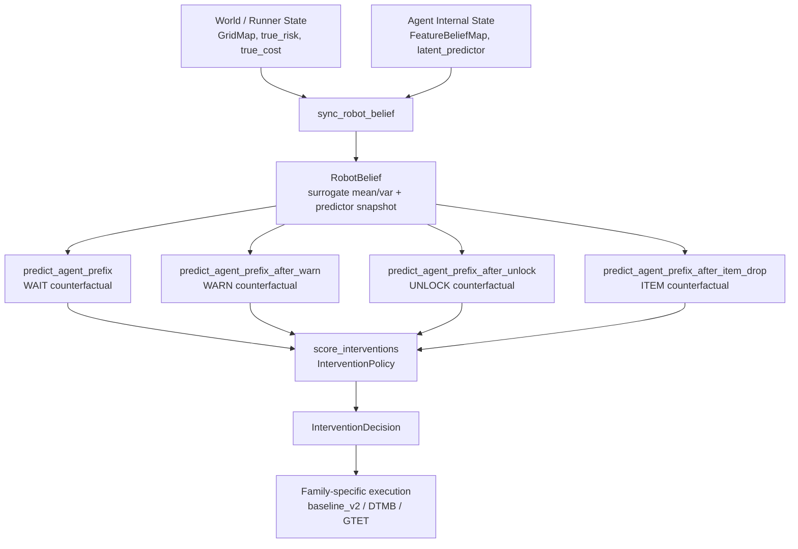

# Phase 3 Situation Report: Teacher-Side Architecture

**Date**: 2026-04-06  
**Scope**: Read-only investigation. No code changes to production modules.

---

## 1. Executive Summary

### Current teacher-side decision cycle

```
sync_robot_belief(agent_belief, predictor)
    → RobotBelief (surrogate snapshot)
        → AgentPredictor (counterfactual rollout on surrogate)
            → PrefixPrediction × 4 branches (WAIT/WARN/UNLOCK/ITEM)
                → InterventionPolicy.score_interventions()
                    → InterventionDecision
                        → runner executes (family-specific dispatch)
```

### Most critical interface problem

**The teacher pipeline has no predictor-agnostic abstraction.** Three distinct layers—`RobotBelief`, `AgentPredictor`, and `InterventionPolicy`—each make independent assumptions about the predictor's internal structure. When `StructuredBasisCostRiskHead` was integrated in Phase 2A, breakage occurred at:
1. `robot_belief.py`: manual weight snapshot assumed `(w, b)` pairs of known dimension
2. `intervention_policy.py`: direct `risk_head.w` access assumed 4D
3. `transfer_eval.py`: snapshot/restore assumed `cost_head.w[:]` assignment into same-shape array
4. `step_logger.py`: theta extraction assumed `lp.d` = raw feature dim

### Verdict: Phase 3A minimal refactor is warranted

The evidence is concrete, not speculative. Phase 2A already required emergency patches. Without Phase 3A cleanup:
- Phase 2B (SlowFast + basis α sweep) will hit the same breakage on `transfer_eval.py` and `step_logger.py`
- Any future head type (prototype/kernel) will require yet another round of ad-hoc patches

**Recommendation: Verdict A — do Phase 3A, but scope it to predictor-agnostic interface only.**

---

## 2. Current Teacher-Side Dataflow

### 2.1 Architecture Diagram



### 2.2 Information Classification

| Data | Source | Classification |
|------|--------|---------------|
| `agent_pos`, `goal`, `t`, `t_max` | Runner | **Environment fact** |
| `gridmap.true_risk/true_cost` | Runner | **Environment fact** (oracle, available to teacher) |
| `passable`, `belief_cost` | Runner | **Derived from agent experience** |
| `feature_belief.mean/var` | Agent | **Agent's uncertain model** |
| `latent_predictor` (weights) | Agent | **Agent's learned parameters** |
| `RobotBelief.agent_belief_mean/var` | Teacher | **Teacher's estimate of agent belief** |
| `RobotBelief._predictor_snapshot` | Teacher | **Teacher's snapshot of agent model** |
| `warned_cell_extra` | Teacher→Agent | **Teacher's intervention effect on planner** |

### 2.3 Confirmed: The main pipeline matches the expected structure

```
(env_state, agent_internal_snapshot) → RobotBelief → AgentPredictor → PrefixPrediction → InterventionPolicy → execution
```

This is verified from code. The `sync_robot_belief` function copies `belief_mean/var` + `deepcopy(predictor)` into `RobotBelief`, `build_surrogate_predictor` returns a deepcopy, `predict_agent_prefix` runs `plan_from_belief` on the surrogate. All counterfactuals are read-only.

---

## 3. Hidden Assumptions Audit

### 3A. Full inventory of internal-structure dependencies

| # | Assumption | File | Line(s) | Trigger | Why fragile | Exposed by basis? |
|---|-----------|------|---------|---------|-------------|-------------------|
| 1 | `cost_head.w` is a flat vector assignable via `[:]` | `transfer_eval.py` | 38-41, 59-63 | `snapshot_learned_params` / `apply_learned_params` | Breaks if predictor uses basis heads (6D/7D weights vs 4D) | **Not yet** (transfer_eval not tested with basis) |
| 2 | `risk_head.w` has same dim as raw features | `intervention_policy.py` | 219 | risk_unc_map computation | Broadcasting `w * w` against `belief_var[..., :4]` | **YES — fixed in Phase 2A** |
| 3 | `cost_head.w.tolist()` + `cost_head.b` = flat theta | `step_logger.py` | 150-154, 160-161 | `_get_theta`, `_get_theta_components` | Depends on specific head class; `d_f = lp.d` used to split theta into cost/risk segments | **Not yet** (logger not tested with basis) |
| 4 | `lp.d` = raw feature dim = weight dim | `step_logger.py` | 300 | `d_f = lp.d if lp else 4` | For basis heads, `lp.d = 4` (raw) but `cost_head.w` has 6 dims | **Not yet** |
| 5 | `risk_head.w` accessed for warn_direction | `lattice_v2_runner.py` | 868, 891 | Legacy warning path | Direct `.w` access, dimension assumed | **No** (only fires on `legacy_bias` path, now demoted) |
| 6 | Predictor can be reconstructed from `(w, b)` pairs | (Old) `robot_belief.py` | 145-160 | `build_surrogate_predictor` | Was building fresh `LatentCostRiskHead(d=len(w))` | **YES — fixed in Phase 2A** |
| 7 | `surrogate_lp.risk_head` passed directly to planner | `agent_predictor.py` | 64 | `plan_from_belief(..., risk_model=surrogate_lp.risk_head)` | Planner uses `risk_head.predict_risk(x)` — works because BasisRiskHead accepts raw 4D and expands internally | **No** (works by accident) |
| 8 | `predict_cost_uncertainty_from_var(x_var)` with `x_var` ∈ R⁴ | `planner_astar.py` | 346 | Belief planning | `StructuredBasisCostRiskHead` proxy uses `w[:4]` slice | **YES — crude proxy added** |

### 3B. Type assumption categories

**Category A: 4D predictor shape** — Items 1–5, 8. This is the dominant fragility.

**Category B: LatentCostRiskHead class identity** — Items 6, 7. Already partially fixed.

**Category C: Runner/teacher mixed responsibility** — `_apply_segment_warning` mixes warning semantic interpretation (RSA belief update) with execution (planner cost injection). Lines 780-910 of runner handle both "what the warning means" and "how to change the agent's cost map."

**Category D: Family-specific bypass** — See §4 below.

---

## 4. Interface Boundary Diagnosis

### 4.1 What belongs to `WorldState`

Already implemented in `agents/world_state.py` — correct scope:
- `agent_pos`, `goal_pos`, `cell_types`, `passable`
- `door_positions`, `doors_unlocked`
- `shield_available/active`
- `t`, `t_max`
- `true_cost/risk` (oracle, teacher-readable)

**Status**: Clean. No changes needed. Not consumed by main pipeline yet (only by shadow `InterventionRiskHead`).

### 4.2 What belongs to `AgentBeliefSnapshot`

Already partially in `agents/agent_belief_state.py` as `AgentBelief`:
- `belief_mean/var` ✓
- `predicted_cost/risk` ✓ (derived from predictor)
- `visit_count`, `observed_mask` ✓
- `m_state` (internalization) ✓
- `theta` (preference type) ✓

**Gap**: No `predictor_adapter` protocol. `AgentBelief` stores derived predictions but doesn't abstract the predictor's predict/uncertainty interface. The current `RobotBelief` holds a raw deepcopy of the full predictor object instead of a typed adapter.

### 4.3 What belongs to `TeacherBeliefState`

Currently split across two modules:
- `RobotBelief` (in `robot_belief.py`): stores surrogate belief + predictor snapshot + sync config
- `RobotBeliefOverAgent` (in `robot_belief_over_agent.py`): nested ToM tracker (shadow mode)

**Gap**: `RobotBelief.copy_mode ∈ {exact, noisy, stale}` is the only sync mechanism. It's clean but lives at the `RobotBelief` level, not in a separate sync/mismatch module.

### 4.4 What belongs to `PredictiveActionModel`

Currently: `agent_predictor.py` — four `predict_agent_prefix_*` functions.

These are clean and read-only. They build a surrogate predictor from `RobotBelief`, run `plan_from_belief`, and return `AgentPrediction`. This module is correctly scoped.

### 4.5 What belongs to `InterventionEffectModel`

Currently: NOT explicit. Effects are hard-coded in `score_interventions()` and runner execution dispatch.

Warning effect = "merge warn_extra_cost into planner cost map"  
Unlock effect = "set cell passable, reset cost to 1.0"  
Item effect = "add shield to inventory"  
Wait effect = "no-op"

These are implicit in the counterfactual rollout. The counterfactual functions (`predict_agent_prefix_after_warn/unlock/item`) implement effect models, but they're not surfaced as a typed interface.

### 4.6 Family routing audit

| Family | Warning dispatch | Execution path | Uses unified `score_interventions`? |
|--------|-----------------|----------------|--------------------------------------|
| baseline_v2 | `_apply_segment_warning` → variant routing | Standard | Yes |
| DTMB | `dtmb_helpers.apply_dtmb_warning` | `dtmb_helpers.apply_dtmb_oracle_action` | Yes (scoring), No (execution bypass via `dtmb_oracle` mode) |
| GTET | `_apply_gtet_warning` + posterior-guided one-shot | Standard + factor modifier | Yes (scoring), custom execution |

All three reach `score_interventions` in the unified path. Family divergence happens at **execution**, not scoring. This is acceptable.

---

## 5. Proposed Minimal Interfaces

### 5.1 `PredictorProtocol` — the critical missing abstraction

```python
from typing import Protocol, runtime_checkable

@runtime_checkable
class PredictorProtocol(Protocol):
    """Shape-agnostic predictor interface.
    
    All teacher-side code should depend ONLY on this protocol,
    never on .cost_head.w or .risk_head.w directly.
    """
    def predict_cost(self, x: np.ndarray) -> float: ...
    def predict_risk(self, x: np.ndarray) -> float: ...
    def predict_cost_uncertainty(self, x: np.ndarray) -> float: ...
    def predict_risk_uncertainty(self, x: np.ndarray) -> float: ...
    def predict_cost_uncertainty_from_var(self, x_var: np.ndarray) -> float: ...
    def predict_risk_uncertainty_from_var(self, x_var: np.ndarray) -> float: ...
    @property
    def n_updates(self) -> int: ...
```

All three head types (`LatentCostRiskHead`, `StructuredBasisCostRiskHead`, `SlowFastCostRiskHead`) already implement this interface by duck typing. Formalizing it prevents internal-state leakage.

### 5.2 `PredictorSnapshot` — replacing manual weight copy

```python
def snapshot_predictor(predictor: PredictorProtocol) -> PredictorProtocol:
    """Deep-copy a predictor. Shape-agnostic."""
    return deepcopy(predictor)

def restore_predictor(target: PredictorProtocol, 
                       source: PredictorProtocol) -> None:
    """Restore target's weights from source. Shape-agnostic."""
    # Copy entire internal state
    target.__dict__.update(deepcopy(source.__dict__))
```

### 5.3 `PredictorDiagnostics` — replacing theta extraction

```python
def extract_theta(predictor: PredictorProtocol) -> list[float]:
    """Extract flat parameter vector for logging.
    
    Shape-agnostic: reads .cost_head.w/.b and .risk_head.w/.b
    regardless of dimension.
    """
    parts = []
    if hasattr(predictor, 'cost_head'):
        parts.extend(predictor.cost_head.w.tolist())
        parts.append(float(predictor.cost_head.b))
    if hasattr(predictor, 'risk_head'):
        parts.extend(predictor.risk_head.w.tolist())
        parts.append(float(predictor.risk_head.b))
    return parts
```

### 5.4 How these interfaces make heads shape-agnostic

| Operation | Current (fragile) | After Phase 3A |
|-----------|-------------------|----------------|
| Snapshot predictor | `RobotBelief` stores deepcopy | `snapshot_predictor()` via protocol |
| Restore predictor | `lp.cost_head.w[:] = snapshot['cost_w']` | `restore_predictor(target, source)` |
| Extract theta for logging | `lp.cost_head.w.tolist() + [b_c] + ...` with hardcoded `d_f` split | `extract_theta(predictor)` with dynamic dim |
| Risk uncertainty map | `w_r = rb._predictor_snapshot.risk_head.w; broadcast against belief_var` | `predictor.predict_risk_uncertainty_from_var(x_var)` per cell |

---

## 6. Behavioral Invariants (Must Not Change)

### A. Canonical benchmark results

| Setting | Current value | Must preserve |
|---------|---------------|---------------|
| `warning_variant` | `rsa_obs_s1` | ✓ |
| `boredom_weight` | 0.3 | ✓ |
| `factor_mode` | `G_THETA` | ✓ |
| baseline_v2 survival (20 seeds) | 0.300 | ✓ |
| GTET survival (20 seeds) | 0.950 | ✓ |

### B. Learner math — DO NOT TOUCH

| Module | Status |
|--------|--------|
| `FeatureBeliefMap` Kalman updates | Frozen |
| `plan_from_belief` / `plan_with_alternatives_v2` | Frozen |
| `BayesianRiskHead.update_from_label` | Frozen |
| `BayesianCostHead.update_from_label` | Frozen |
| A* cost formula | Frozen |

### C. Family-specific semantics — preserve

| Family | Preserve |
|--------|----------|
| DTMB | `dtmb_helpers` dispatch, `apply_dtmb_warning` |
| GTET | Posterior update, one-shot warning, factor modifier |
| baseline_v2 | Segment-level warning routing |

---

## 7. Investigation Results

### 7.1 Static dependency audit

**Who imports from `cost_risk_model.py`:**
- `agents/slow_fast_head.py` → wraps `LatentCostRiskHead`
- `envs/lattice_v2_runner.py` → creates `LatentCostRiskHead` at reset
- `metrics/transfer_eval.py` → `from ..agents.cost_risk_model import LatentCostRiskHead`
- `scripts/phase2a_basis_shadow.py` → creates both head types

**Who directly reads `.cost_head.w` / `.risk_head.w`:**

| File | Access type | Severity |
|------|------------|----------|
| `transfer_eval.py:38-41` | `lp.cost_head.w.copy()` | **HIGH** — will break with basis |
| `transfer_eval.py:59-63` | `lp.cost_head.w[:] = ...` | **HIGH** — shape mismatch crash |
| `step_logger.py:150-161` | `lp.cost_head.w.tolist()` | **MEDIUM** — wrong theta split |
| `intervention_policy.py:219` | `rb._predictor_snapshot.risk_head.w` | **FIXED** — dimension-safe |
| `lattice_v2_runner.py:868,891` | `s.latent_predictor.risk_head.w` | **LOW** — legacy_bias only |
| `slow_fast_head.py:109-119` | `self._inner.cost_head.w` | **INTERNAL** — by design |

### 7.2 Predictor-shape compatibility audit

| Operation | LatentCostRiskHead (4D) | StructuredBasis (6/7D) | SlowFast (wraps 4D) |
|-----------|------------------------|------------------------|---------------------|
| `predict_cost(x)` | ✓ | ✓ (basis expands internally) | ✓ (delegates) |
| `predict_risk(x)` | ✓ | ✓ | ✓ |
| `predict_cost_uncertainty(x)` | ✓ | ✓ | ✓ |
| `predict_risk_uncertainty(x)` | ✓ | ✓ | ✓ |
| `predict_cost_uncertainty_from_var(x_var)` | ✓ (`w @ (x_var * w)`) | ⚠️ crude proxy (`w[:4]`) | ✓ (delegates to 4D inner) |
| `update_from_outcome(x, c, r)` | ✓ | ✓ | ✓ |
| `deepcopy(predictor)` | ✓ | ✓ | ✓ |
| `snapshot via (w, b)` | ✓ | ❌ wrong dimension | ⚠️ inner only |
| `restore via w[:] = ...` | ✓ | ❌ shape mismatch | ⚠️ inner only |
| `.cost_head.w.tolist()` | ✓ (4D) | ✓ (6D) — **but misinterpreted** | ✓ (4D via inner) |

### 7.3 Sync-mode audit

`copy_mode ∈ {exact, noisy, stale}` is implemented entirely within `robot_belief.py`:

- `init_robot_belief()`: applies noise at init (line 80-81)
- `sync_robot_belief()`: applies noise and/or stale skip (lines 119-129)
- `RobotBelief.copy_mode`: stored as string field
- `RobotBelief.stale_interval` / `last_sync_t`: stale-mode bookkeeping

**Clean abstraction?** Yes — the sync mechanism is self-contained in `robot_belief.py`. No other module reads or modifies `copy_mode`. The runner calls `sync_robot_belief()` at line 643 with the agent's current belief. This is a clean boundary.

### 7.4 Family routing audit

| Phase | baseline_v2 | DTMB | GTET |
|-------|-------------|------|------|
| **Scoring** (`score_interventions`) | Unified | Unified | Unified (+ factor modifier) |
| **Warning execution** | `_apply_segment_warning` | `dtmb_helpers.apply_dtmb_warning` | `_apply_gtet_warning` |
| **Unlock execution** | Standard gate open | Standard gate open | Standard gate open |
| **ITEM_DROP execution** | Standard shield add | Standard shield add | Standard shield add |
| **Oracle tutor mode** | N/A | `dtmb_helpers.apply_dtmb_oracle_action` | N/A |

Divergence is at execution only. Scoring is unified. This is acceptable architecture.

### 7.5 Behavior-equivalence smoke test plan

After Phase 3A refactor, run:

```
# Regression matrix: 3 families × 20 seeds × canonical config
python scripts/task3_gtet_z_regression.py --seeds 20

# Plus: verify transfer_eval works with all 3 head types
python -c "
from src.metrics.transfer_eval import snapshot_learned_params, apply_learned_params
# Test with LatentCostRiskHead, StructuredBasisCostRiskHead, SlowFastCostRiskHead
"

# Plus: verify step_logger works with basis head
python -c "
from src.metrics.step_logger import StepLogger
# Run 1 episode with basis head, verify theta extraction
"
```

---

## 8. Final Recommendation

### Verdict A: Do Phase 3A minimal refactor — scoped to 3 files

The evidence is concrete. Phase 2A already broke 2 files; Phase 2B will break 2 more. The scope is narrow and testable.

### Three-step plan

#### Step 1: `PredictorProtocol` + utility functions (NEW file)

Create `src/agents/predictor_protocol.py`:
- `PredictorProtocol` (Protocol class)
- `snapshot_predictor(p) → PredictorProtocol` (deepcopy wrapper)
- `restore_predictor(target, source)` (full state copy)
- `extract_theta(p) → list[float]` (dynamic-dim theta extraction)
- `predictor_summary(p) → dict` (weight norms, update counts)

**Risk**: Zero. New file, no existing code changes.

#### Step 2: Fix `transfer_eval.py` and `step_logger.py`

Replace manual `w[:]` assignment and hardcoded `d_f` split with protocol utilities.

- `snapshot_learned_params` → use `deepcopy(predictor)` instead of manual `(w, b)` extraction
- `apply_learned_params` → use `restore_predictor` instead of `w[:] = ...`
- `_get_theta / _get_theta_components` → use `extract_theta`

**Risk**: Low. These functions are used in eval scripts, not in the main training loop. Regression test: run `transfer_eval` with all 3 head types.

#### Step 3: Regression test

Run the existing smoke test suite to confirm behavioral equivalence:
- Task 3 regression (20 seeds × 3 families)
- Step logger with basis head
- Transfer eval with basis head

---

## Answers to Required Questions

### Q1. What is the most disorganized aspect of the teacher side?

**Predictor internal-state leakage.** Six files directly access `.cost_head.w` / `.risk_head.w`. Of these, `transfer_eval.py` and `step_logger.py` are the most dangerous because they assume specific weight dimensions for serialization and theta decomposition. The runner access points (lines 868, 891) are low-risk because they're in the demoted `legacy_bias` path.

Runner/teacher coupling and family dispatch are secondary issues — they work correctly and don't prevent new head types from integrating.

### Q2. Does the learner need full POMDP rewrite?

**No.** The learner already has:
- Local noisy observation (`observation_model.py`)
- Kalman-style belief update (`FeatureBeliefMap.update_from_obs`)
- Belief-conditioned planning (`plan_from_belief` + bounded A*)
- Online Bayesian weight update (cost/risk heads)

This is a POMDP-like structure. The learner's interface (`predict_cost`, `predict_risk`, `update_from_outcome`) is already clean. No rewrite needed.

### Q3. What is the minimal concrete benefit of Phase 3A?

1. **For Phase 2B**: `transfer_eval.py` will work with `StructuredBasisCostRiskHead` and `SlowFastCostRiskHead` without ad-hoc patches
2. **For future nested ToM**: `TeacherBeliefState` can hold any `PredictorProtocol`, not just `LatentCostRiskHead`
3. **For debugging**: `extract_theta()` produces correct-dimension parameter vectors, `step_logger` generates valid JSONL regardless of head type

### Q4. What must NOT be changed?

| DO NOT | Reason |
|--------|--------|
| Rewrite `FeatureBeliefMap` | Learner belief is clean and validated |
| Rewrite `plan_from_belief` / A* scoring | Core planner math is correct |
| Unify family-specific warning semantics | Family divergence is at execution only; scoring is already unified |
| Migrate to pomdp-py | Over-engineering; current structure is sufficient |
| Add new utility / intervention types | Out of scope for infrastructure cleanup |
| Change `rsa_obs_s1` / `boredom_weight` / `G_THETA` defaults | These are promotion-locked canonical values |
